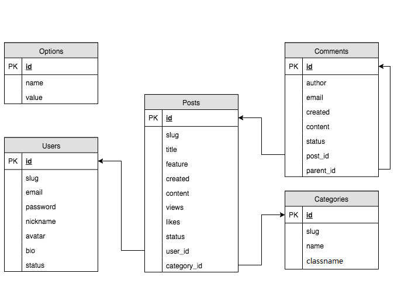

# 准备工作

- 数据库设计
- 基础结构搭建

## 数据库设计

> 根据我们的业务需要设计数据库的结构，这个过程是每个项目开始时所必须的，一般由专门的 DBA 角色完成（很多没有划分的非常具体的公司由后端开发人员兼任）。



### 选项表（options）

用于记录网站的一些配置属性信息，如：站点标题，站点描述等

| 字段    | 描述    | 备注         |
| ----- | ----- | ---------- |
| id    | 🔑 主键 | &nbsp;     |
| key   | 属性键   | snake_case |
| value | 属性值   | JSON 格式    |

### 用户表（users）

用于记录用户信息

| 字段       | 描述     | 备注                                       |
| -------- | ------ | ---------------------------------------- |
| id       | 🔑 主键  | &nbsp;                                   |
| slug     | URL 别名 | &nbsp;                                   |
| email    | 邮箱     | 亦做登录名                                    |
| password | 密码     | &nbsp;                                   |
| nickname | 昵称     | &nbsp;                                   |
| avatar   | 头像     | 图片 URL 路径                                |
| bio      | 简介     | &nbsp；                                   |
| status   | 状态     | 未激活（unactivated）/ 激活（activated）/ 禁止（forbidden）/ 回收站（trashed） |

### 文章表（posts）

用于记录文章信息

| 字段          | 描述       | 备注                                       |
| ----------- | -------- | ---------------------------------------- |
| id          | 🔑 主键    | &nbsp;                                   |
| slug        | URL 别名   | &nbsp;                                   |
| title       | 标题       | &nbsp;                                   |
| feature     | 特色图像     | 图片 URL 路径                                |
| created     | 创建时间     | &nbsp;                                   |
| content     | 内容       | &nbsp;                                   |
| views       | 浏览次数     | &nbsp;                                   |
| likes       | 点赞数      | &nbsp;                                   |
| status      | 状态       | 草稿（drafted）/ 已发布（published）/ 回收站（trashed） |
| user_id     | 🔗 用户 ID | 当前文章的作者 ID                               |
| category_id | 🔗 分类 ID | 当前文章的分类 ID                               |

> 提问：为什么要用关联 ID？

<!-- 答：数据同步，便于维护 -->

### 分类表（categories）

用于记录文章分类信息

| 字段        | 描述     | 备注     |
| --------- | ------ | ------ |
| id        | 🔑 主键  | &nbsp; |
| slug      | URL 别名 | &nbsp; |
| name      | 分类名称   | &nbsp; |
| classname | 图标类名   |        |

### 评论表（comments）

用于记录文章评论信息

| 字段        | 描述       | 备注                                       |
| --------- | -------- | ---------------------------------------- |
| id        | 🔑 主键    | &nbsp;                                   |
| author    | 作者       | &nbsp;                                   |
| email     | 邮箱       | &nbsp;                                   |
| created   | 创建时间     | &nbsp;                                   |
| content   | 内容       | &nbsp;                                   |
| status    | 状态       | 待审核（held）/ 准许（approved）/ 拒绝（rejected）/ 回收站（trashed） |
| post_id   | 🔗 文章 ID | &nbsp;                                   |
| parent_id | 🔗 父级 ID | &nbsp;                                   |

> **生成表格和添加数据的sql文件放在同目录的sql文件夹下面**

---

## 搭建项目架构

项目最基本的分为两个大块，前台（对大众开放）和后台（仅对管理员开放）。

一般在实际项目中，有的人会把前台和后台分为两个项目去做，部署时也会分开部署：

- **前台访问地址**：`https://www.baixiu11.net/`
- **后台访问地址**：`https://admin.baixiu11.net/`

这样做相互独立不容易乱，也更加安全。但是有点麻烦，所以我们采用更为常见的方案：让后台作为一个子目录出现。这样的话，大体结构就是：

- **前台访问地址**：`https://www.baixiu11.net/`
- **后台访问地址**：`https://www.baixiu11.net/admin/`

### 基本的目录结构

```
└── baixiu ······································ 项目文件夹（网站根目录）
    ├── admin ··································· 后台文件夹
    │   └── index.php ··························· 后台脚本文件
    ├── static ·································· 静态文件夹
    │   ├── assets ······························ 资源文件夹
    │   └── uploads ····························· 上传文件夹
    └── index.php ······························· 前台脚本文件
```

#### 基本原则：

- 先明确一共有多少个页面
- 一个页面就对应一个 php 文件去处理

### 整合静态资源文件

#### 静态文件 vs. 动态文件

- 静态文件指的就是服务器不会经过任何处理就返回给客户端浏览器的文件，比如：图片、样式表、字体文件等
- 动态文件指的就是服务器会对请求的文件进行处理，并将处理后的结果返回给客户端浏览器的文件，比如：PHP 文件、ASP 文件、JSP 文件

#### 具体操作

由于 Apache / Nginx 这一类 Web Server 本身可以处理静态文件请求，所以不需要 PHP 处理静态文件请求。只需要将静态资源放到网站目录中，即可访问

```
└── baixiu ······································ 项目文件夹（网站根目录）
   ├──static ····························· 静态资源文件夹
   │  ├── assets ······························ 资源文件夹 
   │  │	 ├── css ····························· 样式文件夹
   │  │	 ├── img ····························· 图片文件夹
   │  │	 ├── js ······························ 脚本文件夹
   │  │	 └── venders ························· 第三方资源
   │  ├─ uploads ····························· 上传文件夹
   │     └── 2017 ···························· 2018 年上传文件目录
   ├── ......
```

##### 注意：

- `admin` 后台项目文件管理。
- `assets` 目录中放置网页中所需的资源文件。
- `uploads` 目录中放置网站运营过程中上传的文件，如果担心文件过多，可以按年归档（一年一个文件夹）。
- 发给大家的静态文件目录是需要修改的，请按照约定的目录进行修改


### 修改过静态文件结构之后，要把资源的路径都修改正确

 1.  把所有的css文件路径修改

     原有的css文件路径为

     ```html
     <link rel="stylesheets" href="asstes/css/xxx.css"></link>
     ```

     需要全部修改为

     ```html
     <link rel="stylesheets" href="static/asstes/css/xxx.css"></link>
     ```

     2. 同理把所欲放在assets之下的所有的图片的路径也修改为static的子目录

    原为
    
    ​```html
    
    ​```
    
    需要全都修改为
    
    ​```html
    
    ​```
    
    ​

###将所有的html页面修改为php页面

​	我们在项目中需要使用的是php文件对数据进行读取和展示，所以需要把所有的html文件都修改为php文件。如果对cmd命令不太熟悉，可以自己手动一个页面一个页面的进行修改后缀名。

​	但是这样做是比较麻烦的。所以可以给大家介绍如何使用cmd命令重命名文件

 1.  首先需要进入你写项目的目录所在的盘符

     使用`win+R` 打开快速运行，在输入框中输入 `cmd` 打开命令窗口

     使用`盘符:` 进入项目所在盘符，例如： `F:` 是进入F盘，然后使用cd命令输入目录进入到项目文件所在的目录，例如：`cd F:\project\baixiu` 就是进入F盘下面的project目录下的baixiu文件夹

     2. 使用命令`ren *.html *.php` 把所有的html后缀名全都修改成php后缀

     3. 记得把所有页面中的a标签所指向的html文件的路径也改成php的后缀

### 抽离公共模块

通过观察页面的布局，我们发现，页面的两边在任何一个页面都是一样的，所以我们可以把这部分代码抽离出来形成公共部分，方便我们对其进行管理。

于是我们在 `baixiu` 目录中创建一个 `public`子目录，在这个目录里创建一个 `_aside.php` 文件，用于抽象公共的右边区域 `<div class="aside"> ... </div>`，然后在每一个需要这个模块的页面中通过 `include` 载入：

```php
...
<?php include 'public/_aside.php' ;?>
...
```
之后同上在public目录下建立一个`_header.php` 文件，把左边  `<div class="header"> ... </div>`  部分也抽离成为一个公共模块，也采用同样的方式载入
```php
...
<? php include 'public/_header.php' ; ?>
...
```

>
> 提问：为什么使用 `include` 而不是 `require`？

<!-- 答：侧边栏不会影响其他模块，没有侧边栏其余代码应该也可以继续执行 -->

### 项目配置文件

由于在接下来的开发过程中，肯定有一部分公共的成员，例如数据库名称，数据库主机，数据库用户名密码等，这些数据应该放到公共的地方，抽象成一个配置文件 `config.php` 放到项目根目录下。

这个配置文件采用定义常量的方式定义配置成员：

```php
/**
 * 数据库主机
 */
define('DB_HOST', '127.0.0.1');

/**
 * 数据库用户名
 */
define('DB_USER', 'root');

/**
 * 数据库密码
 */
define('DB_PASS', '123');

/**
 * 数据库名称
 */
define('DB_NAME', 'db_baixiu');
```

> 注意：这种只有服务端代码的 PHP 文件可以去除结尾处的 `?>`，防止输出内容

在需要的时候可以通过 `require_once` 载入：

```php
// 载入配置文件
require_once 'config.php';

...

// 用到的时候
echo DB_NAME;
```

#### 载入脚本的几种方式对比

> - `require`
> - `require_once`
> - `include`
> - `include_once`

- 共同点：
  + 都可以在当前 PHP 脚本文件执行时载入另外一个 PHP 脚本文件。
- `require` 和 `include` 不同点：
  + 当载入的脚本文件不存在时，`require` 会报一个致命错误（结束程序执行），而 `include` 不会
- 有 `once` 后缀的特点：
  + 判断当前载入的脚本文件是否已经载入过，如果载入了就不再执行

> 提问：由以上几种方式的对比可以得出：在载入 `config.php` 时使用哪种方式更合适？

<!-- 答：require_once，原因有二：1. 载入失败无法继续执行；2. 不能重复载入 -->
