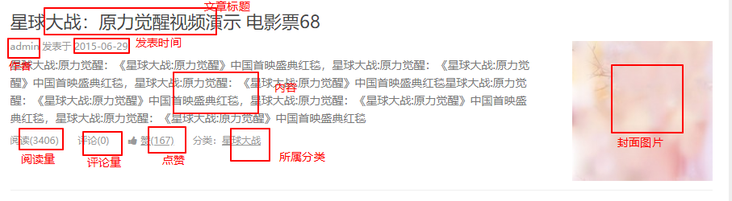

# 文章分类列表页

## 文章分类筛选功能

我们点击页面上的分类导航的时候，可以跳转到`list.php` 页面对文章根据分类进行筛选，而我们筛选的原理是根据文章的分类id对文章进行条件查询。所以我们在跳转到`list.php`的时候，可以把分类的id带到`list.php`页面，即为：`list.php?id=分类id`

因此我们在动态生成分类导航的结构的时候，要把文章分类的id加到a标签里面，所以需要先打开`_header.php`把动态渲染分类的代码先修改一下。

```php+HTML
  <ul class="nav">
    <!-- 遍历二维数组，生成结构 -->
    <?php foreach ($arr as $value) : ?>
    	<!-- 主要是把href属性的值修改为带上文章的id --> 
      <li><a href="list.php?categoryId=<?php echo $value['id']; ?>"><i class="fa <?php echo $value['classname'] ?>"></i><?php echo $value['name'] ?></a></li>
    <?php endforeach ?>
  </ul>
  <div class="search">
```

这样生成的分类导航就可以跳转到`list.php`页面，也可以带有分类的id了

接下来我们就需要在`list.php`页面中写代码了。先完成连接数据库的操作

```php
	require_once 'config.php';

	//1 获取分类id
    $categoryId = $_GET["categoryId"];
    // 2 根据分类id查询数据库
    // 2.1 连接数据库
    $connect = mysqli_connect(DB_HOST,DB_USER,DB_PWD,DB_NAME);
    // 2.2 sql语句
    $sql = "";
    //2.3 执行查询语句
    $postResult = mysqli_query($connect,$sql);
    // 2.4 将结果集转换为二维数组
    $postArr = [];
    while ($row = mysqli_fetch_assoc($postResult)) {
       $postArr[] = $row;
    }
```

此时仍然要观察在页面中有哪些数据需要从数据库中获取



由此我们的数据库的sql语句可以写成

```mysql
	# 查询各种数据
	SELECT p.id,p.title,p.created,p.content,p.views,p.likes,p.feature,u.nickname,c.`name`,
	# 根据文章id查找评论量
    (select count(id) FROM comments WHERE comments.post_id = p.id) as commentCount
     FROM posts p
     # 联表查询
    LEFT JOIN users u ON u.id = p.user_id
    LEFT JOIN categories c on c.id = p.category_id
    # 根据获取的分类id对文章数据进行筛选
    WHERE p.category_id = {$categoryId}
    # 限定只获取10条
    LIMIT 10
```

所以我们把sql语句写到php代码中后

```php
	...    
	//1 获取分类id
    $categoryId = $_GET["categoryId"];
    // 2 根据分类id查询数据库
    // 2.1 连接数据库
    $connect = mysqli_connect(DB_HOST,DB_USER,DB_PWD,DB_NAME);
    // 2.2 sql语句
    $sql = "SELECT p.title,p.created,p.content,p.views,p.likes,p.feature,u.nickname,c.`name`,
    (select count(id) FROM comments WHERE comments.post_id = p.id) as commentCount
     FROM posts p
    LEFT JOIN users u ON u.id = p.user_id
    LEFT JOIN categories c on c.id = p.category_id
    WHERE p.category_id = {$categoryId}
    LIMIT 10";
    //2.3 执行查询语句
    $postResult = mysqli_query($connect,$sql);
    // 2.4 将结果集转换为二维数组
    $postArr = [];
    while ($row = mysqli_fetch_assoc($postResult)) {
       $postArr[] = $row;
    }
	...
```

最后仍然在需要展示的地方动态渲染


```php+HTML
<div class="content">
  <div class="panel new">
    <h3><?php echo $postArr[0]['name'] ?></h3>
    <!-- 遍历数组，动态生成结构 -->
    <?php foreach ($postArr as $value): ?>
    <div class="entry">
      <div class="head">
        <a href="detail.php?postId=<?php echo $value['id']; ?>"><?php echo $value['title'] ?></a>
      </div>
      <div class="main">
        <p class="info"><?php echo $value['nickname'] ?> 发表于 <?php echo $value['created'] ?></p>
        <p class="brief"><?php echo $value['content'] ?></p>
        <p class="extra">
          <span class="reading">阅读(<?php echo $value['views'] ?>)</span>
          <span class="comment">评论(<?php echo $value['commentCount'] ?>)</span>
          <a href="javascript:;" class="like">
            <i class="fa fa-thumbs-up"></i>
            <span>赞(<?php echo $value['likes'] ?>)</span>
          </a>
          <a href="javascript:;" class="tags">
            分类：<span><?php echo $value['name'] ?></span>
          </a>
        </p>
        <a href="javascript:;" class="thumb">
          " alt="">
        </a>
      </div>
    </div>
    <?php endforeach ?>   
  </div>
</div>
```

## 封装重复的查询操作到公共模块

此时我们发现，我们查找数据的功能，代码都很接近，因此我们每次使用的时候，没必要都写，最好可以封装起来，每当想要使用直接使用即可。

所以我们开始封装一些在项目中常用的代码。

在根目录下新建一个`functions.php` 我们把查询数据库的操作封装起来

```php
	/*
	连接数据库的封装
	*/
	function connect(){
		$connect = mysqli_connect(DB_HOST,DB_USER,DB_PWD,DB_NAME);
		return $connect;
	}
	/*
	执行查询的封装
	*/
	function query($connect,$sql){
		$result = mysqli_query($connect,$sql);
		return fetch($result);
	}
	/*
	转换结果集为二维数组的封装
	*/
	function fetch($result){
		$arr = [];
	    while ($row = mysqli_fetch_assoc($result)) {
	        $arr[] = $row;
	    }
	    return $arr;
	}
	/*
```

封装好之后，我们查询数据就不必要那么麻烦了。直接在`list.php`中引入公共模块

```php
require_once 'config.php';
  //因为functions.php是依赖于config.php的，需要在config.php之后引入
require_once 'functions.php';
```

之后直接使用封装好的函数对数据进行查询

```php
// 1 获取文章分类的id
$categoryId = $_GET["categoryId"];
// 2 根据分类id查询数据库
// 2.1 连接数据库
$connect = connect();
// 2.2 根据分类id查询数据库
$sql = "SELECT p.id,p.title,p.created,p.content,p.views,p.likes,p.feature,u.nickname,c.`name`,
    (select count(id) FROM comments WHERE comments.post_id = p.id) as commentCount
     FROM posts p
    LEFT JOIN users u ON u.id = p.user_id
    LEFT JOIN categories c on c.id = p.category_id
    WHERE p.category_id = {$categoryId}
    LIMIT 10";

//调用封装好的查询函数来进行查询
$postArr = query($connect, $sql);
```

这样使用起来就方便很多了。


## 加载更多按钮的功能

文章根据分类筛选出来了，但是只有10条，如果用户还想看，就没有数据了，所以我们可以准备一个按钮，让用户点击的时候加载更多的数据。

首先在所有的文章末尾，动态生成分类文章的后面添加一个加载更多的按钮

```	php+HTML
<!-- 加载更多的按钮功能 -->
<div class="loadmore">
  <span class="btn">加载更多</span>
</div>
```

此时需要给他添加一些样式，打开`static/assets/css/style.css`这个文件，添加一些样式代码

```css
.loadmore {
  text-align: center;
  padding: 50px 0;
}
.loadmore .btn {
  border: 1px solid #ccc;
  border-radius: 7px;
  padding: 10px 20px;
  cursor: pointer;
}
```

接着给该按钮注册一个点击事件。

```javascript
$(".loadmore .btn").on("click",function () { });
```

**因为我们要使用jquery来注册事件，所以记得先引入jquery**

每次加载更多都是一次新的请求，因此我们需要准备一个数据接口，然后使用ajax进行异步请求数据。在根目录下新建一个`api`文件夹，我们所有关于前台数据的接口都写在里面。

在`api`文件夹下面新建一个`_getMorePost.php`用来获取数据，在这个php文件里面，我们要根据当前页面要获取第几页数据，每页获取多少条数据来获取前台需要的数据。所以需要前台传递两个参数回来： 

1. 当前是第几次获取数据
2. 一共要获取多少条数据

```php
// _getMorePost.php
//1 获取必要的参数
$categoryId = $_POST["categoryId"];
$currentPage = $_POST["currentPage"];
$pageSize = $_POST["pageSize"];
// 1.2 计算出要从哪里开始获取
$offset = ($currentPage - 1) * $pageSize;
//2 查询数据库
//2.1 连接数据库
$connect = connect();
//2.2 sql语句
$sql = "SELECT p.id,p.title,p.created,p.content,p.views,p.likes,p.feature,u.nickname,c.`name`,
(select count(id) FROM comments WHERE comments.post_id = p.id) as commentCount
FROM posts p
LEFT JOIN users u ON u.id = p.user_id
LEFT JOIN categories c on c.id = p.category_id
WHERE p.category_id = {$categoryId}
LIMIT {$offset},{$pageSize}";
//2.3 执行差选
$postArr = query($connect,$sql);
$response = ["code"=>0,"msg"=>"操作失败"];

//3 返回数据
if($postArr){
  $response["code"] = 1;
  $response["msg"] = "操作成功";
  $response["data"] = $postArr;
}
// 以json格式返回数据
header("content-type: application/json;charset=utf-8;");
echo json_encode($response);
```

当后台的数据接口准备好了之后，想要得到数据，就直接使用ajax请求完成即可

```javascript
$(function(){
      //定义一个变量，记录当前是第几次获取数据
      var currentPage = 1;
      //给加载更多的按钮注册点击事件
      $(".loadmore .btn").on("click",function () {
        // 获取文章的分类id
        var categoryId = location.search.split("=")[1];
        //每次点击加载更多，都是获取下一次的数据
        currentPage++;
        // 请求后台，加载更多的跟当前分类相关的数据
        $.ajax({
          url: 'api/_getMorePost.php',
          type: 'POST',
          data: {categoryId:categoryId,currentPage:currentPage,pageSize:10},
          success:function (res) { ... } 
          });
      });
});
```

将数据请求回来之后，我们可以把数据动态的添加到`加载更多`的按钮之前

```javascript
$(function(){
  //定义一个变量，记录当前是第几次获取数据
  var currentPage = 1;
  //给加载更多的按钮注册点击事件
  $(".loadmore .btn").on("click",function () { 
    // 获取文章的分类id
    var categoryId = location.search.split("=")[1];
    //每次点击加载更多，都是获取下一次的数据
    currentPage++;
    // 请求后台，加载更多的跟当前分类相关的数据
    $.ajax({
      url: 'api/_getMorePost.php',
      type: 'POST',
      data: {categoryId:categoryId,currentPage:currentPage,pageSize:10},
      success:function (res) {
        // 判断该次请求有没有数据
        if(res.code == 1){
          // 遍历数组，动态生成结构
          var data = res.data;
          $.each(data, function(index, val) {
            var str = '<div class="entry">\
            <div class="head">\
            <a href="detail.php?postId='+ val["id"] +'">'+ val['title'] +'</a>\
            </div>\
            <div class="main">\
            <p class="info">'+ val['nickname'] +' 发表于 '+ val['created'] +'</p>\
            <p class="brief">'+ val['content'] +'</p>\
            <p class="extra">\
            <span class="reading">阅读('+ val['views'] +')</span>\
            <span class="comment">评论('+ val['commentCount'] +')</span>\
            <a href="javascript:;" class="like">\
            <i class="fa fa-thumbs-up"></i>\
            <span>赞('+ val['likes'] +')</span>\
            </a>\
            <a href="javascript:;" class="tags">\
            分类：<span>'+ val['name'] +'</span>\
            </a>\
            </p>\
            <a href="javascript:;" class="thumb">\
            \
            </a>\
            </div>\
            </div>';
			// 使用jquery的方式生成结构
            var entry = $(str);
            // 插入到加载更多的按钮之前
            entry.insertBefore('.loadmore');
          });
        }
      }
    });
  });
});
```

 但是我们的文章数据不是无限多的，一直点击加载更多肯定会有把所有的数据全部获取完毕的时候，因此如果没有数据了，应该就不能再继续加载更多了。我们可以在后台的数据接口那里返回一个最大的获取的次数，这样就可以在前台对比，如果当前的此时已经是最大的次数，那么就无法再继续获取了。

先把后台的数据接口准备好返回的最大次数

```php
//1 获取必要的参数
$categoryId = $_POST["categoryId"];
$currentPage = $_POST["currentPage"];
$pageSize = $_POST["pageSize"];
// 1.2 计算出要从哪里开始获取
$offset = ($currentPage - 1) * $pageSize;
//2 查询数据库
//2.1 连接数据库
$connect = connect();
//2.2 sql语句
$sql = "SELECT p.id,p.title,p.created,p.content,p.views,p.likes,p.feature,u.nickname,c.`name`,
		    (select count(id) FROM comments WHERE comments.post_id = p.id) as commentCount
		     FROM posts p
		    LEFT JOIN users u ON u.id = p.user_id
		    LEFT JOIN categories c on c.id = p.category_id
		    WHERE p.category_id = {$categoryId}
		    LIMIT {$offset},{$pageSize}";
//2.3 执行查询
$postArr = query($connect,$sql);
// 3 还需要返回一个最大的加载次数
// 3.1 准备sql语句，查询文章的总的数量
$sqlCount = "SELECT count(id) as postCount FROM posts WHERE category_id = {$categoryId}";
// 3.2 执行语句
$countArr = query($connect,$sqlCount);
// 3.3 因为查询结果是二维数组,需要从二维数组中获取出总共能获取的次数
$pageCount = $countArr[0]['postCount'];
$response = ["code"=>0,"msg"=>"操作失败"];

//4 返回数据
if($postArr){
  $response["code"] = 1;
  $response["msg"] = "操作成功";
  $response["data"] = $postArr;
  $response["pageCount"] = $pageCount;
}
header("content-type: application/json;charset=utf-8;");
echo json_encode($response);
```

而我们相应的在前台页面也要判断是否到达了最大次数，如果到达了最大的次数，那就把加载更多的按钮隐藏起来

```javascript
$(function(){
  //定义一个变量，记录当前是第几次获取数据
  var currentPage = 1;
  //给加载更多的按钮注册点击事件
  $(".loadmore .btn").on("click",function () { 
    // 获取文章的分类id
    var categoryId = location.search.split("=")[1];
    //每次点击加载更多，都是获取下一次的数据
    currentPage++;
    // 请求后台，加载更多的跟当前分类相关的数据
    $.ajax({
      url: 'api/_getMorePost.php',
      type: 'POST',
      data: {categoryId:categoryId,currentPage:currentPage,pageSize:10},
      success:function (res) {
        console.log(res);
        // 判断该次请求有没有数据
        if(res.code == 1){
          // 遍历数组，动态生成结构
          var data = res.data;
          $.each(data, function(index, val) {
            var str = '<div class="entry">\
            <div class="head">\
            <a href="detail.php?postId='+ val["id"] +'">'+ val['title'] +'</a>\
            </div>\
            <div class="main">\
            <p class="info">'+ val['nickname'] +' 发表于 '+ val['created'] +'</p>\
            <p class="brief">'+ val['content'] +'</p>\
            <p class="extra">\
            <span class="reading">阅读('+ val['views'] +')</span>\
            <span class="comment">评论('+ val['commentCount'] +')</span>\
            <a href="javascript:;" class="like">\
            <i class="fa fa-thumbs-up"></i>\
            <span>赞('+ val['likes'] +')</span>\
            </a>\
            <a href="javascript:;" class="tags">\
            分类：<span>'+ val['name'] +'</span>\
            </a>\
            </p>\
            <a href="javascript:;" class="thumb">\
            \
            </a>\
            </div>\
            </div>';
            var entry = $(str);
            entry.insertBefore('.loadmore');
          });
          // 生成结构完毕之后，需要判断一下，这次获取文章数据是不是已经是最后的数据了
          // 假设 99 篇文章 ， 每次获取10篇 ， 一共可以获取 10次
          // 最大的获取次数 = ceil(总的文章数 / 每次获取的数量)
          // 如果当前的次数跟最大的次数一样了，就是最后一次获取了
          // 就不应该再显示加载更多了
          // 计算出最大的获取次数
          var maxPage = Math.ceil(res.pageCount / 10);
          // 判断当前的次数是不是已经是最大的次数了
          if(currentPage == maxPage){
            // 隐藏加载更多的按钮
            $(".loadmore .btn").hide();
          }
        }
      }
    });
  });
});
```

