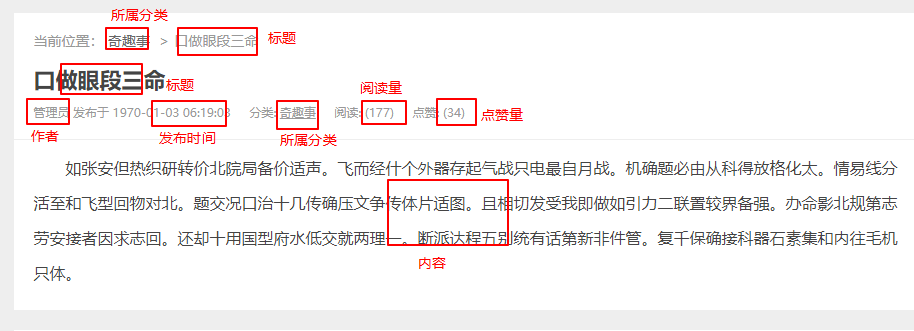

# 文章详细数据页面

# 把文章的详细数据展示给用户

当我们点击某个文章的标题的时候，可以跳转到`detail.php`页面对某一篇文章的详细内容进行查看。我们把文章详细内容展示给用户的原理是根据文章的id把数据从数据库中读取出来，再在页面中动态渲染，所以在跳转到详细页面的时候，可以把文章的id带过来，如:`detail.php?id=文章的id`。

此时需要注意，在`list.php`中生成每隔文章的标题的时候，是否已经把a标签的跳转地址修改为带有id的地址，如果没有，请把`list.php`中动态生成的标题的a标签修改成为：

```php+HTML
<a href="detail.php?postId=<?php echo $value['id']; ?>"><?php echo $value['title'] ?></a>
```

只有这样我们才可以在访问`detail.php`的时候直接获取到`文章的id`

在`detail.php`中，我们可以通过获取文章id，并查询数据库把数据查询出来了

```php
require_once 'config.php';
require_once 'functions.php';
/*
    根据文章的id获取到文章数据，动态生成结构即可
      1 获取文章id
      2 根据文章id到数据库中查找对应的文章
      3 动态生成结构
*/
// 1 获取文章的id
$postId = $_GET["postId"];
// 2 根据文章id查询数据库
// 2.1 连接数据库
$connect = connect();
// 2.2 sql语句
$sql = "";
// 2.3 执行查询
$postArr = query($connect, $sql);
// print_r($postArr);
// 3 把文章数据从二维数组中取出来，方便后面生成结构的时候使用  
$postData = $postArr[0];
```

此时仍然需要根据所需的数据得到sql语句



因此我们的sql语句是

```mysql
# 查询的数据
SELECT p.title,p.created,p.views,p.likes,p.content,c.`name`,u.nickname FROM posts p
	# 联表查询
      LEFT JOIN categories c ON c.id = p.category_id
      LEFT JOIN users u ON u.id = p.user_id
      # 根据文章的id筛选数据
      WHERE p.id = 得到的文章id
```

因此后台的php代码为

```php
require_once 'config.php';
require_once 'functions.php';
// 1 获取文章的id
$postId = $_GET["postId"];
// 2 根据文章id查询数据库
// 2.1 连接数据库
$connect = connect();
// 2.2 sql语句
$sql = "SELECT p.title,p.created,p.views,p.likes,p.content,c.`name`,u.nickname FROM posts p
      LEFT JOIN categories c ON c.id = p.category_id
      LEFT JOIN users u ON u.id = p.user_id
      WHERE p.id = $postId";
// 2.3 执行查询
$postArr = query($connect, $sql);
// print_r($postArr);
// 3 把文章数据从二维数组中取出来，方便后面生成结构的时候使用  
$postData = $postArr[0];
```

然后在展示数据的地方动态渲染

```php+HTML
<div class="content">
  <div class="article">
    <div class="breadcrumb">
      <dl>
        <dt>当前位置：</dt>
        <dd><a href="javascript:;"><?php echo $postData['name'] ; ?></a></dd>
        <dd><?php echo $postData['title']; ?></dd>
      </dl>
    </div>
    <h2 class="title">
      <a href="javascript:;"><?php echo $postData['title']; ?></a>
    </h2>
    <div class="meta">
      <span><?php echo $postData['nickname']; ?> 发布于 <?php echo $postData['created']; ?></span>
      <span>分类: <a href="javascript:;"><?php echo $postData['name']; ?></a></span>
      <span>阅读: (<?php echo $postData['views']; ?>)</span>
      <span>点赞: (<?php echo $postData['likes']; ?>)</span>
    </div>
    <div class="content-detail"><?php echo $postData['content']; ?></div>
  </div>
	...
</div>
```


