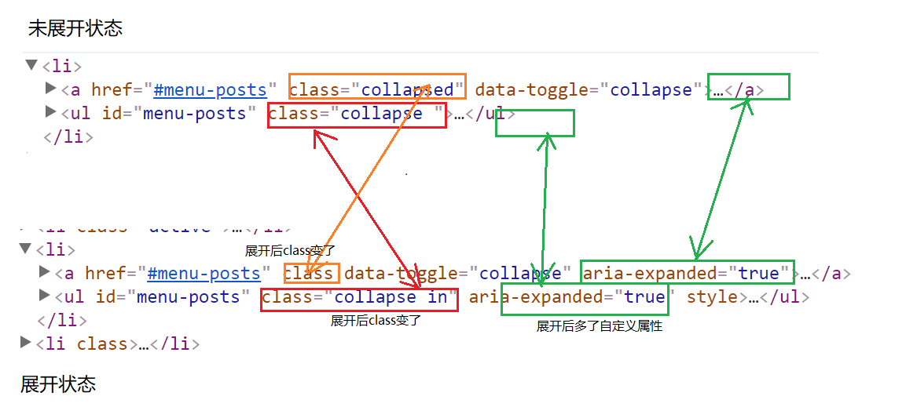

# 后台页面的主页面

## 抽离公共模块

通过观察后台的页面发现，除了登录以外的后台页面，左边的导航和顶部区域也是一样的，所以我们也可以把他们作为公共模块进行管理

在`admin`目录下建立`public`文件夹，把每个页面中的`<div class="aside">...</div>` 部分和 `<nav class="navbar">...</div>` 部分抽离成为公共模块。分别以`_aside.php`和`_navbar.php`作为其模块文件。之后在这些页面中使用 `include_once` 引入这些公共模块。

---

## 处理抽离公共模块之后左侧导航的问题

我们发现把公共模块抽离之后，左侧的导航栏点击起来有问题。我们展开子导航之后，点击子导航跳转后没有保持展开状态，因此要特殊处理一下。

我们对比展开和不展开的结构



所以只要在我们访问对应的页面的时候，设置展开和收起的状态即可。我们采用的方式是：在页面中定义一个变量：`$current_page`当这个变量是指定的页面的时候，我们就设定这个页面为展开。将`_aside.php`中的代码修改为：

```php+HTML
<ul class="nav">
      <li class="<?php echo $current_page == "index" ? "active" : "" ?>">
        <a href="index.php"><i class="fa fa-dashboard"></i>仪表盘</a>
      </li>
      <li>
      	<?php 
  			// 准备一个数组,用来判断当前页面是否在这个大的分类下面
      		$pageArr = ["posts","post-add","categories"];
          	// 判断页面中定义的 $current_page 是否在数组中，如果在就展开
      		$bool = in_array($current_page,$pageArr);      		
      	 ?>
        <!-- 判断页面中定义的 $current_page 是否在数组中，如果在就展开 -->
        <a href="#menu-posts" class="<?php echo $bool ? "" : "collapsed" ?>" data-toggle="collapse" <?php echo $bool ? 'aria-expanded="true"' : ""; ?>>
          <i class="fa fa-thumb-tack"></i>文章<i class="fa fa-angle-right"></i>
        </a>
        <ul id="menu-posts" class="collapse <?php echo $bool ? "in" : "" ?>" <?php echo $bool ? 'aria-expanded="true"' : "" ?>>
          <!-- active 这个class 是用来处理当前的li高亮显示的 -->
          <li class="<?php echo $current_page == "posts" ? "active" : "" ?>"><a href="posts.php">所有文章</a></li>
          <li class="<?php echo $current_page == "post-add" ? "active" : "" ?>"><a href="post-add.php">写文章</a></li>
          <li class="<?php echo $current_page == "categories" ? "active" : "" ?>"><a href="categories.php">分类目录</a></li>
        </ul>
      </li>
      <li class="<?php echo $current_page == "comments" ? "active" : "" ?>">
        <a href="comments.php"><i class="fa fa-comments"></i>评论</a>
      </li>
      <li class="<?php echo $current_page == "users" ? "active" : "" ?>">
        <a href="users.php"><i class="fa fa-users"></i>用户</a>
      </li>
      <li>
        <?php 
          $pageArr = ["nav-menus","slides","settings"];
          $bool = in_array($current_page,$pageArr);
         ?>
        <a href="#menu-settings" class="<?php echo $bool ? "" : "collapsed" ?>" data-toggle="collapse" <?php echo $bool ? 'aria-expanded="true"' : ""; ?>>
          <i class="fa fa-cogs"></i>设置<i class="fa fa-angle-right"></i>
        </a>
        <ul id="menu-settings" class="collapse <?php echo $bool ? "in" : ""; ?>" <?php echo $bool ? 'aria-expanded="true"' : ""; ?>>
          <li class="<?php echo $current_page == "nav-menus" ? "active" : "" ?>"><a href="nav-menus.php">导航菜单</a></li>
          <li class="<?php echo $current_page == "slides" ? "active" : "" ?>"><a href="slides.php">图片轮播</a></li>
          <li class="<?php echo $current_page == "settings" ? "active" : "" ?>"><a href="settings.php">网站设置</a></li>
        </ul>
      </li>
    </ul>
```

有了上述代码之后，比如我们在所有文章的页面`posts.php`中声明一个`$current_page`

```php+HTML
<?php 
// 在公共文件之前声明变量，可以被公共文件访问,就可以根据这个变量判断是否展开
$current_page = "posts";
?>
 <?php include_once 'public/_aside.php'; ?>
```

## 动态获取当前的用户的头像和昵称

我们在主页面上面，还能看到用户的昵称和头像，此时一样需要动态的加载。我们可以在登录成功，访问后台页面的时候，发送一个ajax请求到服务端对头像和昵称进行获取。

在`_aside.php`中添加一个ajax请求

```javascript
$(function(){
  // 使用ajax请求，动态获取用户的头像和昵称
  $.ajax({
    type : "POST",
    url : "api/_getUserAvator.php",
    success : function (res) { ... }
  });
});
```

然后我们在`admin/api`目录下新建一个`_getUserAvator.php`文件，在这个文件中处理请求。我们获取用户的昵称和头像需要根据用户的id来获取，但是我们在前端并没有把用户的id得到。所以我们得思考一下，如何得到用户的id。

我们在登录成功的时候，可以把用户的id也存储在服务端。这样我们登录的用户到服务端对当前用户的数据进行获取和操作的时候就可以得到id。因此的先把`_userLogin.php`中的代码改一改。

```php
// 省略查询的代码
// 3 判断查询的结果是不是由数据
$response = ["code"=>0,"msg"=>"操作失败"];
if($queryResult){
  // 3.1 如果登录成功了，应该把登录的状态记录一下
  session_start();
  $_SESSION['isLogin'] = 1;
  // 3.2 把用户的id也存储起来，以便将来可以用来获取跟用户相关的数据
  $_SESSION['user_id'] = $queryResult[0]['id'];
  $response["code"] = 1;
  $response["msg"] = "登录成功";
}
// 4 以json格式返回数据
header("content-type: application/json;charset=utf-8");
echo json_encode($response);
```

这样我们在服务端就可以获取到用户的id了。那么现在完成`_getUserAvator.php`。

```php
require_once '../../config.php';
require_once '../../functions.php';

//获取用户的头像和昵称，返回给前端动态生成
// 因为获取用户的头像和昵称，需要用户的id，而我们一开始在登录的时候，就把用户的id存放到了session里面，只需要从session中获取即可
session_start();
$userId = $_SESSION["user_id"];
// echo $userId;
// 根据用户的id，到数据库中查询用户的头像和昵称
// 1 连接数据库
$connect = connect();
// 2 准备sql语句
$sql = "SELECT * FROM users WHERE id = {$userId}";
// 3 执行查询
$queryResult = query($connect,$sql);
// 4 判断是否查到数据，返回前端
$response = ["code"=>0,"msg"=>"操作失败"];;
if($queryResult){
  $response["code"] = 1;
  $response["msg"] = "操作成功";
  $response["avatar"] = $queryResult[0]['avatar'];
  $response["nickname"] = $queryResult[0]['nickname'];
}
// 5 以json格式返回数据
header("content-type: application/json");
echo json_encode($response);
```

之后在前端对返回的数据进行动态修改到页面结构中

```javascript
$(function(){
  // 使用ajax请求，动态获取用户的头像和昵称
  $.ajax({
    type : "POST",
    url : "api/_getUserAvator.php",
    success : function (res) {
      // 从服务端得到的结果再生产头像和名字
      if(res.code == 1){
        //  请求成功之后，应该把得到的头像和昵称修改一下
        var profile = $(".profile");
        profile.children('img').attr("src",res.avatar);
        profile.children('h3').text(res.nickname);
      }
    }
  });
});
```


