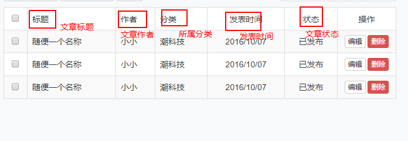

# 后台页面的所有文章页面

## 所有文章的数据展示功能

所有文章在一开始加载页面的时候就会显示文章的数据，所以在一开始的时候，我们就可以使用一个ajax请求获取文章的数据

```javascript
$(function(){
  // 第一次请求，把数据请求回来，动态生成表格
  $.ajax({
    url : "api/_getPostsData.php",
    type : "POST",
    data : { },
    success : function(res){ ... }
    }
  });
});
```

在`admin/api`目录下新建一个`_getPostsData.php`文件，处理请求所有文章的请求

```php
require_once '../../config.php';
require_once '../../functions.php';
// 连接数据库
$connect = connect();
// sql语句
$sql = "";
// 把查询的结果返回前端
$response = ['code'=>0,'msg'=>"操作失败"];
if($result){
  $response['code'] = 1;
  $response['msg'] = "操作成功";
  $response['data'] = $result;
}
header("content-type: application/json;charset=utf-8");
echo json_encode($response);
```

观察所需的数据，决定sql语句所需的数据



根据上图，我们得到的sql语句为

```mysql
# 查询各种的字段
SELECT p.id,p.title,p.created,p.`status`,u.nickname,c.`name` FROM posts p
# 联表查询
left JOIN users u ON u.id = p.user_id
LEFT JOIN categories c ON c.id = p.category_id
```

php中的代码可以修改成

```php
require_once '../../config.php';
require_once '../../functions.php';
// 连接数据库
$connect = connect();
// sql语句
$sql = "SELECT p.id,p.title,p.created,p.`status`,u.nickname,c.`name` FROM posts p
left JOIN users u ON u.id = p.user_id
LEFT JOIN categories c ON c.id = p.category_id";

$result = query($connect, $sql);
// 把查询的结果返回前端
$response = ['code'=>0,'msg'=>"操作失败"];
if($result){
  $response['code'] = 1;
  $response['msg'] = "操作成功";
  $response['data'] = $result;
}
header("content-type: application/json;charset=utf-8");
echo json_encode($response);
```

此时可以得到数据了，在前端的ajax请求中可以动态的渲染数据了

```javascript
// 第一次请求，把数据请求回来，动态生成表格
$.ajax({
  url : "api/_getPostsData.php",
  type : "POST",
  data : {},
  success : function(res){
    // 如果请求成功，把数据渲染到表格当中
    if(res.code == 1){
      var data = res.data;
      // 生成分页结构
      // 遍历数组生成新的元素之前，先把原有的内容清空
      $("tbody").empty();
      // 遍历data数组，生成表格结构
      $.each(data, function(index, val) {
        var str = '<tr>\
        <td class="text-center"><input type="checkbox"></td>\
        <td>'+ val.title +'</td>\
        <td>'+ val.nickname +'</td>\
        <td>'+ val.name +'</td>\
        <td class="text-center">'+ val.created +'</td>\
        <td class="text-center">'+ val.status +'</td>\
        <td class="text-center">\
        <a href="javascript:;" class="btn btn-default btn-xs">编辑</a>\
        <a href="javascript:;" class="btn btn-danger btn-xs">删除</a>\
        </td>\
        </tr>';
        $(str).appendTo('tbody');
      });
    }
  }
});
```

此时的数据表格中有两个问题：

   	1. 把数据库中的所有的文章都获取出来了，一次性展示的数据太多对用户来说不是好的体验，对服务器来说也会有压力。
  2. 文章的状态还是英文，对用户体验也不好

先把状态的英文转换为中文，数据库中，我们已经在数据库的设计的时候约定好了每个英文所代表的状态，所以我们只要根据对应的英文转换为对应的中文即可。可以直接判断英文字符串转换为中文，但是那样做比较麻烦，我们可以采用另外的方式完成。

先定义一个键值对的集合

```javascript
var statusData = {
  drafted : "草稿",
  published : "已发布",
  trashed : "已作废"
};
```

我们在生成结构的时候，直接根据对应的字符串作为键，取出对应的值放到结构中即可

```javascript
// 遍历data数组，生成表格结构
$.each(data, function(index, val) {
  var str = '<tr>\
  <td class="text-center"><input type="checkbox"></td>\
  <td>'+ val.title +'</td>\
  <td>'+ val.nickname +'</td>\
  <td>'+ val.name +'</td>\
  <td class="text-center">'+ val.created +'</td>\
  <td class="text-center">'+ statusData[val.status] +'</td>\
  <td class="text-center">\
  <a href="javascript:;" class="btn btn-default btn-xs">编辑</a>\
  <a href="javascript:;" class="btn btn-danger btn-xs">删除</a>\
  </td>\
  </tr>';
  $(str).appendTo('tbody');
});
```

## 分页展示数据

刚才提到的数据量过大的问题，我们一般采用分页展示的方式处理。这样对用户来说，一次性展示的数据量比较少，信息量比较容易接受，对服务器来说，每次获取的数据少了，压力也会小。

那么要如何分页显示呢？我们在点击右上角的分页按钮的时候，会切换数据，并且分页按钮也会切换，所以数据是动态生成的，分页按钮也是动态生成的，所以先把分页按钮里面的li标签先去掉。

```html
<ul class="pagination pagination-sm pull-right">
  <!-- <li><a href="#">上一页</a></li>
  <li><a href="#">1</a></li>
  <li><a href="#">2</a></li>
  <li><a href="#">3</a></li>
  <li><a href="#">下一页</a></li> -->
</ul>
```

然后我们动态生成这部分的结构。

首先我们看到的是页面上一共显示5个数字按钮，上一页和下一页一共7个按钮。5个数字按钮是可以循环生成的。所以我们直接使用循环生成5个数字按钮，前后在补上两个按钮即可

```javascript
var html = "";
html += '<li><a href="javascript:;">上一页</a></li>';
//循环生成5个数字按钮
for(var i = 1; i <= 5; i++){
    html += '<li><a href="javascript:;">'+ i +'</a></li>';
}
html += '<li><a href="javascript:;">下一页</a></li>';
$(".pagination").html(html);
```

我们再来观察，发现是有一个数字按钮需要跟其他的数字按钮不一样的，而不一样的数字按钮表示的是当是第几页数据。通过修改li的class可以控制某个数字按钮跟其他的不一样，所以我们需要一个表示当前页的变量和判断处理当前高亮

```javascript
// 声明一个变量，记录当前是第几页数据
var currentPage = 1;
var html = "";
html += '<li class="item" ><a href="javascript:;">上一页</a></li>';
//循环生成5个数字按钮
for(var i = 1; i <= 5; i++){
    if(i == currentPage){
      html += '<li class="item active"><a href="javascript:;">'+ i +'</a></li>';
    }else {
      html += '<li class="item" ><a href="javascript:;">'+ i +'</a></li>';
    }
}
html += '<li class="item"><a href="javascript:;">下一页</a></li>';
$(".pagination").html(html);
```

但是我们所看到的分页数字的按钮，并不是什么时候都是从1开始的，所以我们的根据当前页动态计算出从哪里开始和到哪里结束，并且特殊处理一些特殊情况。

```javascript
// 声明一个变量，记录当前是第几页数据
var currentPage = 1;
// 声明一个变量表示最大页码数
var pageCount = 4;
// 根据当前页计算出开始的页码和结束的页码
// 开始页码 = 当前页码 - 2
var start = currentPage - 2;
// 如果开始的页码数小于1的，强制控制从1开始
if(start < 1){
  start = 1;
}
// 结束的页码 = 开始页码 + 4
var end = currentPage + 4;
// 如果结束页码超过了最大的页码数，特殊处理
if(end > pageCount){
  end = pageCount;
}
```

此时在来动态生成就比较合理了。

```javascript
html += '<li class="item" ><a href="javascript:;">上一页</a></li>';
//循环生成5个数字按钮
for(var i = start; i <= end; i++){
    if(i == currentPage){
      html += '<li class="item active"><a href="javascript:;">'+ i +'</a></li>';
    }else {
      html += '<li class="item" ><a href="javascript:;">'+ i +'</a></li>';
    }
}
html += '<li class="item"><a href="javascript:;">下一页</a></li>';
$(".pagination").html(html);
```

接着我们来思考一个问题：分页获取也总有一天会把所有数据获取完毕的，所以有一个最大的页码数，那么这个最大的页码数应该是多少呢？假设现在一共有104条数据，每页显示10条，那么应该需要11页才能显示完毕，所以最大页码数 = Math.ceil(( 数据总数  /  每页显示的数据))

所以我们还需要两个数据来算出最大的页码数。每页显示多少条我们可以自己定义

```javascript
// 使用变量保存每一页获取多少条数据
var pageSize = 10;
```

但是数据总量只能在后台数据获取，所以我们得等到处理后台逻辑的时候再处理了。

接着处理一个比较特殊的情况，就是当前如果是第一页，是没有上一页的，以及当前如果是最后一页，也是没有下一页的。所以我们在生成的时候也要判断一下才能处理这种情况。即在生成的代码要特殊处理一下。

```javascript
var html = "";
//判断当前是佛第一页
if(currentPage != 1){
  html += '<li class="item"><a href="javascript:;">上一页</a></li>';
}
for(var i = start; i <= end; i++){
  if(i == currentPage){
    html += '<li class="item active"><a href="javascript:;">'+ i +'</a></li>';
  }else {
    html += '<li class="item"><a href="javascript:;">'+ i +'</a></li>';
  }
}
//判断当前是否最后一页
if(currentPage != pageCount){
  html += '<li class="item"><a href="javascript:;">下一页</a></li>';
}
$(".pagination").html(html);
```

接着在我们点击分页按钮的时候，分页按钮也是会切换的，因此要给这些分页按钮注册一下点击事件，又因为是动态生成的按钮，所以需要委托注册,而我们在点击的时候，又要切换当前页数，所以在点击的时候需要一个当前点击的按钮代表的页码，我们可以把这个页面存储在按钮身上，因此我们生成结构的时候要加上自定义属性

```javascript
var html = "";
if(currentPage != 1){
  //使用自定义属性记录按钮代表的页数
  html += '<li class="item" data-page="'+ (currentPage - 1) +'"><a href="javascript:;">上一页</a></li>';
}
for(var i = start; i <= end; i++){
  if(i == currentPage){
    //使用自定义属性记录按钮代表的页数
    html += '<li class="item active" data-page="'+ i +'"><a href="javascript:;">'+ i +'</a></li>';
  }else {
    //使用自定义属性记录按钮代表的页数
    html += '<li class="item" data-page="'+ i +'"><a href="javascript:;">'+ i +'</a></li>';
  }
}
if(currentPage != pageCount){
  //使用自定义属性记录按钮代表的页数
  html += '<li class="item" data-page="'+ (currentPage + 1) +'"><a href="javascript:;">下一页</a></li>';
}
$(".pagination").html(html);
```

此时再点击事件里面就可以获取到按钮代表的页数了，就可以切换页码，也可以根据当前页码到服务器获取数据

```javascript
 $(".pagination").on("click",".item",function(){
   //获取按钮代表的页码
   currentPage = parseInt($(this).attr('data-page'));
   //根据当前页码到服务端获取数据
   $.ajax({
     url : "",
     type : "POST",
     data : {},
     success: function(){
       // 切换页码的代码应该在获取数据成功之后处理。
     }
   });
   });
 });
```

此时我们需要改造一下`_getPostsData.php`，因为现在是分页获取数据了。

根据我们之前的分析，我们分页数据需要获取限定条数的数据，而我们在服务端可以使用sql语句限定获取多少条

```mysql
SELECT p.id,p.title,p.created,p.`status`,u.nickname,c.`name` FROM posts p
left JOIN users u ON u.id = p.user_id
LEFT JOIN categories c ON c.id = p.category_id
# 通过LIMIT 限定获取多少条
LIMIT 0,10 -- 此时是获取前面10条
```

如果要获取第二页的十条，我们的写法是：

```mysql
LIMIT 10,10
```

要获取第三页的10条，写法是：

```mysql
LIMIT 20,10
```

规律是：

```mysql
LIMIT (当前页 - 1) * 每页条数,每页条数
```

所以我们如果要完成这样一条sql语句，需要前端给我们两个数据： 1. 当前要第几页,2. 每页获取多少条

后台代码改造

```php
// 从前端获取两个数据  ： 当前是第几页  一共要获取多少条
$currentPage = $_POST['currentPage'];
$pageSize = $_POST['pageSize'];
// 计算出sql语句从哪里开始获取数据
// 从哪里开始获取 = (要获取的页码数 - 1) * 每页获取的数据的条数
$offset = ($currentPage - 1) * $pageSize;
// 连接数据库
$connect = connect();
// sql语句 -- 改造了sql语句
$sql = "SELECT p.id,p.title,p.created,p.`status`,u.nickname,c.`name` FROM posts p
left JOIN users u ON u.id = p.user_id
LEFT JOIN categories c ON c.id = p.category_id
LIMIT {$offset},{$pageSize}"
// 执行查询
$result = query($connect,$sql);
// 把查询的结果返回前端
$response = ['code'=>0,'msg'=>"操作失败"];
if($result){
  $response['code'] = 1;
  $response['msg'] = "操作成功";
  $response['data'] = $result;
}
header("content-type: application/json;charset=utf-8");
echo json_encode($response);
```

前端在点击分页按钮的时候就可以请求对应的数据了

```javascript
/*
使用委托的方式给每个分页按钮注册点击事件
*/
$(".pagination").on("click",".item",function(){
  // 根据当前的页码获取数据
  currentPage = parseInt($(this).attr('data-page'));
  // 根据当前页到服务端请求数据
  $.ajax({
    url : "api/_getPostsData.php",
    type : "POST",
    data : { currentPage : currentPage , pageSize : pageSize },
    success : function(res){
      if(res.code == 1){
        var data = res.data;
        // 遍历数组生成新的元素之前，先把原有的内容清空
        $("tbody").empty();
        // 遍历数组重新生成表格结构
        $.each(data, function(index, val) {
          var str = '<tr>\
          <td class="text-center"><input type="checkbox"></td>\
          <td>'+ val.title +'</td>\
          <td>'+ val.nickname +'</td>\
          <td>'+ val.name +'</td>\
          <td class="text-center">'+ val.created +'</td>\
          <td class="text-center">'+ statusData[val.status] +'</td>\
          <td class="text-center">\
          <a href="javascript:;" class="btn btn-default btn-xs">编辑</a>\
          <a href="javascript:;" class="btn btn-danger btn-xs">删除</a>\
          </td>\
          </tr>';
          $(str).appendTo('tbody');
        });
        //再来根据当前页重新生成分页的结构
        //... 后面封装好了之后直接调用
      }
    }
  });
});
```

此时毫无疑问的是，再次生成分页结构的代码应该是和以前一样的，所以我们可以把以前的代码封装一下，在点击事件的回调函数中直接调用就好。

```javascript
// 使用变量保存每一页获取多少条数据
var pageSize = 10;
// 声明一个变量，记录当前是第几页数据
var currentPage = 1;
// 最大的页码数 = Math.ceil(文章的数据的总量 / 每一页获取的数据的条数);
var pageCount = 4;

function makePageButton(){
  // 根据当前页计算出开始的页码和结束的页码
  // 开始页码 = 当前页码 - 2
  var start = currentPage - 2;
  // 如果开始的页码数小于1的，强制控制从1开始
  if(start < 1){
    start = 1;
  }
  // 结束的页码 = 开始页码 + 4
  var end = currentPage + 4;
  // 如果结束页码超过了最大的页码数，特殊处理
  if(end > pageCount){
    end = pageCount;
  }
  var html = "";
  if(currentPage != 1){
    html += '<li class="item" data-page="'+ (currentPage - 1) +'"><a href="javascript:;">上一页</a></li>';
  }
  for(var i = start; i <= end; i++){
    if(i == currentPage){
      html += '<li class="item active" data-page="'+ i +'"><a href="javascript:;">'+ i +'</a></li>';
    }else {
      html += '<li class="item" data-page="'+ i +'"><a href="javascript:;">'+ i +'</a></li>';
    }

  }
  if(currentPage != pageCount){
    html += '<li class="item" data-page="'+ (currentPage + 1) +'"><a href="javascript:;">下一页</a></li>';
  }
  $(".pagination").html(html);
}
```

## 解决最大分页的问题

此时分页按钮可以获取数据也可以切换按钮了，但是我们切换到了第四页，就没法再切换了，很明显的是数据肯定不止四页，而是由于我们在一开始声明变量的时候，就设定了最大页码为4页，我们也分析过了，最大页码数应该由服务端的最大数据条数决定。所以我们在一开始获取第一次数据的时候就求出最大页码数。再生产分页结构就可以解决这个问题。

修改第一次请求数据的代码

```javascript
// 第一次请求，把数据请求回来，动态生成表格
      $.ajax({
        url : "api/_getPostsData.php",
        type : "POST",
        // 后台文件要求带回两个参数，所以把这两个数据带回后台
        data : { currentPage : currentPage , pageSize : pageSize},
        success : function(res){ ... }
      });
```

此时我们需要在后台计算出最大页码数用来生成分页按钮，所以得继续对后台代码进行改造。

打开`_getPostsData.php`，把计算最大页码数的代码加上。

```php
require_once '../../config.php';
require_once '../../functions.php';
// 从前端获取两个数据  ： 当前是第几页  一共要获取多少条
$currentPage = $_POST['currentPage'];
$pageSize = $_POST['pageSize'];
// 计算出sql语句从哪里开始获取数据
// 从哪里开始获取 = (要获取的页码数 - 1) * 每页获取的数据的条数
$offset = ($currentPage - 1) * $pageSize;
// 连接数据库
$connect = connect();
// sql语句
$sql = "SELECT p.id,p.title,p.created,p.`status`,u.nickname,c.`name` FROM posts p
left JOIN users u ON u.id = p.user_id
LEFT JOIN categories c ON c.id = p.category_id
LIMIT {$offset},{$pageSize}";
// 执行查询
$result = query($connect,$sql);
// 查询到了数据之后，再来计算出最大的页码数 -- 先查询出数据总条数
$countSql = "SELECT count(*) as count FROM posts";
// 执行总数的查询
$countArr = query($connect,$countSql);
$postCount = $countArr[0]['count'];
// 计算页码的最大值 = ceil(文章总数 / 每页的数据条数) -- 再计算最大页码数
$pageCount = ceil($postCount / $pageSize);
// 把查询的结果返回前端
$response = ['code'=>0,'msg'=>"操作失败"];
if($result){
  $response['code'] = 1;
  $response['msg'] = "操作成功";
  $response['data'] = $result;
  $response['pageCount'] = $pageCount;
}
header("content-type: application/json");
echo json_encode($response);
```

此时在前端就可以获取到最大页码数，前端第一次请求数据的代码为

```javascript
// 第一次请求，把数据请求回来，动态生成表格
$.ajax({
  url : "api/_getPostsData.php",
  type : "POST",
  // 后台文件要求带回两个参数
  data : { currentPage : currentPage , pageSize : pageSize},
  success : function(res){
    // 如果请求成功，把数据渲染到表格当中
    if(res.code == 1){
      var data = res.data;
      // 还要计算出页码的最大值
      pageCount = res.pageCount;
      // 生成分页结构
      makePageButton();
      // 生成数据表格
      // 遍历数组生成新的元素之前，先把原有的内容清空
      $("tbody").empty();
      // 遍历数组重新生成表格结构
      $.each(data, function(index, val) {
        var str = '<tr>\
        <td class="text-center"><input type="checkbox"></td>\
        <td>'+ val.title +'</td>\
        <td>'+ val.nickname +'</td>\
        <td>'+ val.name +'</td>\
        <td class="text-center">'+ val.created +'</td>\
        <td class="text-center">'+ statusData[val.status] +'</td>\
        <td class="text-center">\
        <a href="javascript:;" class="btn btn-default btn-xs">编辑</a>\
        <a href="javascript:;" class="btn btn-danger btn-xs">删除</a>\
        </td>\
        </tr>';
        $(str).appendTo('tbody');
      });
    }
  }
});
```

而这个时候我们又发现了，我们每次请求数据都要生成数据表格，而且逻辑是一模一样的，因此我们也可以把生成表格的逻辑也封装成函数

```javascript
function makeTable(data){
  // 遍历数组生成新的元素之前，先把原有的内容清空
  $("tbody").empty();
  // 遍历data数组，生成表格结构
  $.each(data, function(index, val) {
    var str = '<tr>\
    <td class="text-center"><input type="checkbox"></td>\
    <td>'+ val.title +'</td>\
    <td>'+ val.nickname +'</td>\
    <td>'+ val.name +'</td>\
    <td class="text-center">'+ val.created +'</td>\
    <td class="text-center">'+ statusData[val.status] +'</td>\
    <td class="text-center">\
    <a href="javascript:;" class="btn btn-default btn-xs">编辑</a>\
    <a href="javascript:;" class="btn btn-danger btn-xs">删除</a>\
    </td>\
    </tr>';
    $(str).appendTo('tbody');
  });
}
```

所以我们所有请求数据的ajax都可以改造成这样

```javascript
$.ajax({
  url : "api/_getPostsData.php",
  type : "POST",
  data : { currentPage : currentPage , pageSize : pageSize },
  success : function(res){
    // 如果请求成功，把数据渲染到表格当中
    if(res.code == 1){
      var data = res.data;
      // 还要计算出页码的最大值
      pageCount = res.pageCount;
      // 生成分页结构
      makePageButton();
	  // 生成数据表格
      makeTable(data);
    }
  }
});
```

**记得把分页的点击事件的回调函数里面的获取数据也修改一下**

此时最大分页的问题和获取数据量太大的问题就都解决了。

## 筛选数据功能实现

我们发现，在这个页面中，还有一个筛选功能的需要实现。这里的筛选有两个条件，一个是状态，一个是分类，因此我们要在后台对数据根据分类和状态筛选

首先需要解决的问题是，分类是可能随时改变的，所以分类的数据需要动态的生成。我们之前已经准备好了一个分类数据的获取数据接口：`_getCategoryData.php`，所以现在我们直接使用ajax请求即可

```javascript
/*
先加载所有的分类数据
*/
$.ajax({
  url : "api/_getCategoryData.php",
  type : "POST",
  success : function(res){
    // console.log(res);  
    // 判断请求是否成功
    if(res.code == 1){
      // 遍历数组，生成多个下拉选项，追加到下拉框里面
      var data = res.data;
      $.each(data,function(i,e){
        var html = '<option>'+ e.name +'</option>';
        $(html).appendTo('#category');
      });
    }        
  }
});
```

而我们在服务端进行条件查询的时候，文章表格中存储的是分类的id，而不是分类的名称，因此，我们需要根据文章的分类id进行筛选，也就是说我们在前端传递回服务端的数据应该是分类的id，所以我们可以在生成分类列表的时候，把分类的id存储在option标签的value属性里面，这样我们可以直接得到下拉框的value就是分类的id，因此动态生成结构的代码需要改造一下：

```javascript
$.ajax({
  url : "api/_getCategoryData.php",
  type : "POST",
  success : function(res){
    // 判断请求是否成功
    if(res.code == 1){
      // 遍历数组，生成多个下拉选项，追加到下拉框里面
      var data = res.data;
      $.each(data,function(i,e){
        var html = '<option value="'+ e.id +'">'+ e.name +'</option>';
        $(html).appendTo('#category');
      });
    }        
  }
});
```

同样的在分类的结构里面，我们也使用value属性存储对应的状态的英文，这样我们在获取的时候也是可以直接通过下拉框的value获取。

```html
<select id="status" name="" class="form-control input-sm">
  <option value="">所有状态</option>
  <option value="drafted">草稿</option>
  <option value="published">已发布</option>
  <option value="trashed">已删除</option>
</select>
```

而我们并不是什么时候都要筛选的，有时候也是不筛选的，所以我们可以约定一个值，当得到的下拉框的值是这个值的时候，就是不筛选。我们约定，当下拉框选中的值是 `all` 的时候，就是不筛选。所以两个下拉框的静态结构里面直接可以写上为`all`的选项

```html
<!-- 状态下拉框 -->
<select id="status" name="" class="form-control input-sm">
  <option value="all">所有状态</option>
  <option value="drafted">草稿</option>
  <option value="published">已发布</option>
  <option value="trashed">已删除</option>
</select>
<!-- 分类下拉框 -->
<select id="category" name="" class="form-control input-sm">
  <option value="all">所有分类</option>
	<!-- 这里的结构由ajax动态生成 -->
</select>
```

所以我们在服务端的代码需要根据这两个条件继续改造，首先需要多获取两个参数

```php
// 还要获取筛选的条件
$status = $_POST['status'];
// 获取分类的id
$categoryId = $_POST['categoryId'];
```

一般来说，我们筛选条件有时有，有时没有的时候，这个时候我们筛选的sql关键字 `where` 判断起来处理是比较麻烦的，我们可以利用sql语句的一个小技巧：`where` 后面跟着一个用于成立的条件也是可以的：

```mysql
select * from tables where 1=1
```

所以我们的后台代码修改为：

```php
// 从前端获取两个数据  ： 当前是第几页  一共要获取多少条
$currentPage = $_POST['currentPage'];
$pageSize = $_POST['pageSize'];
// 还要获取筛选的条件
$status = $_POST['status'];
// 获取分类的id
$categoryId = $_POST['categoryId'];
// 如果是有时候需要条件筛选，有时候又不需要条件筛选，通过判断是否有条件再来决定是否有where是比较麻烦的，习惯的处理方式是：  where 1=1
// 只有当有条件的时候，我们再来把条件拼接到where的后面
$where = " where 1=1 ";
```

然后再来根据约定，判断是否有筛选条件，控制`where` 后面的sql代码。我们的约定是：如果条件得到的值是all，则不筛选，所以反过来判断，如果不是all就是有条件的筛选。

```php
// 判断有无筛选条件，修改 $where 即可
if($status != "all"){
  $where .= " and p.status = '{$status}' ";
}
// 判断分类的id是否也属于筛选的条件
if( $categoryId != "all"){
  $where .= " and p.category_id = '{$categoryId}'";
}
```

最后再把条件拼接到sql语句中

```php
// sql语句
$sql = "SELECT p.id,p.title,p.created,p.`status`,u.nickname,c.`name` FROM posts p
left JOIN users u ON u.id = p.user_id
LEFT JOIN categories c ON c.id = p.category_id" . $where . "LIMIT {$offset},{$pageSize}";
```

就可以根据条件进行筛选了。

现在我们只需要在前端获取数据的时候，也把两个筛选的条件带上，就可以筛选数据了。

先给筛选按钮注册一个点击事件。

```javascript
/*
 点击筛选功能
 */
$("#btn-filt").on("click",function(){
  // 点击筛选的时候，先得到状态时什么
  var status = $("#status").val();
  // 获取分类的id
  var categoryId = $("#category").val();
  // 把条件带回服务端请求数据
  $.ajax({
    url : "api/_getPostsData.php",
    type : "POST",
    data : {currentPage : currentPage, pageSize : pageSize , status : status , categoryId : categoryId },
    success : function(res){
      if(res.code == 1){
        pageCount = res.pageCount;
        // 生成分页结构
        makePageButton();
        // 遍历数组，生成表格结构
        var data = res.data;
        makeTable(data);
      }
    }
  });
})
```

同时把其他的获取数据的地方也修改为四个参数，因为他们请求的都是同一个数据接口，其他请求数据的地方包括：第一次请求数据和点击分页按钮请求数据

```javascript
// 第一次请求，把数据请求回来，动态生成表格
$.ajax({
  url : "api/_getPostsData.php",
  type : "POST",
  // 后台文件要求带回两个参数
  data : { currentPage : currentPage , pageSize : pageSize , status : $("#status").val() , categoryId : $("#category").val()},
  success : function(res){
    // 如果请求成功，把数据渲染到表格当中
    if(res.code == 1){
      var data = res.data;
      // 还要计算出页码的最大值
      pageCount = res.pageCount;
      // 生成分页结构
      makePageButton();
	  // 生成表格结构
      makeTable(data);
    }
  }
});
```


