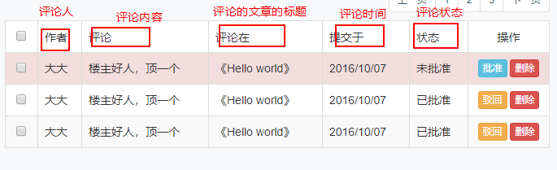
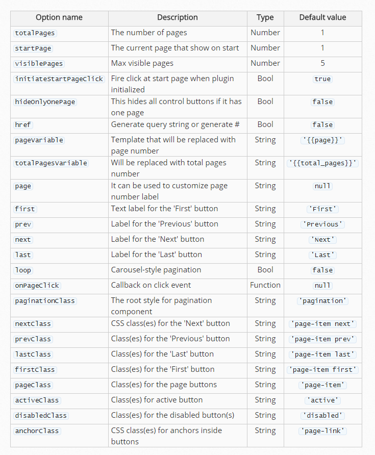

## 后台页面的评论管理

## 分页获取评论数据

​	对于评论数据的管理功能来说，评论数据的数据量也是很大的，我们也需要像处理文章那样分页展示给用户，因此我们需要分页的获取评论的数据。

​	首先我们直接在页面加载的时候获使用ajax获取数据。

```javascript
$(function(){
  // 当前页数
  var currentPage = 1;
  // 每页显示多少条数据
  var pageSize = 10;
  // 总的页面数
  var pageCount;
  // 发送ajax请求
  $.ajax({
          url : "api/_getCommentsData.php",
          type : "POST",
          data : {currentPage : currentPage , pageSize : pageSize},
          success : function(res){ ... }
        });
});
```

但是由之前我们完成文章数据的分页获取的经验得出，请求数据是需要重复使用的，所以我们把请求数据的过程封装起来，然后直接调用函数获取。

```javascript
getCommentsData();
function getCommentsData(){
  $.ajax({
    url : "api/_getCommentsData.php",
    type : "POST",
    data : {currentPage : currentPage , pageSize : pageSize},
    success : function(res){ ... }
  });
}
```

​	然后我们在请求成功的回调函数中对数据进行渲染。我们之前的做法都是拼接字符串的方式渲染数据的，这种做法比较麻烦，执行效率也不高。因此，这里我们采用模板引擎的方式渲染数据。

​	模板引擎其实无非也是一种插件，用于生成页面结构的插件。他的原理是先准备好一个模板，之后遍历数据采用替换的方式把模板中的占位符替换成数据然后生成结构。

​	在这个项目中使用的是 [art-template](http://aui.github.io/art-template/) 模板引擎，也是一款用法比较简单的模板引擎插件。其使用过程和其他插件相差不多，也是要先引入插件，然后根据插件的使用方式进行使用即可。

### 模板的使用

1. 引入插件

   ```html
   <script src="../static/assets/vendors/art-template/template-web.js"></script>
   ```

2. 建立模板

   `art-template`模板引擎采用script标签作为模板载体，因为当script标签的type不是javascript的时候，是不会被解析执行的。模板的写法很简单

   ```html
   <!-- 准备一个type='text/art-template' 的script标签 -->
   <script id="template" type="text/art-template">
   	// 把要重复生成的结构放在模板里面，使用 {{占位字符}} 的形式书写占位符
   	// $data 代表的是导入的数据
   	<div>{{$data}}</div>
   </script>
   ```

3. 导入数据,生成结构

   ```html
   <script>
     // 在模板后面调用api导入数据
     // 使用语法：template(模板id,数据);
     var html = template("template",data);
     // 此时html变量就是结构。需要手动的把结构放到页面中
     $("selector").append(html);
   </script>
   ```

   ---

   该模板甚至还可以进行条件判断、遍历数据等操作，大致语法如下：

   ```javascript
   // 遍历数据的语法
   {{each $data 值 键}}
   	<div>{{ 值.属性 }}</div>
   {{/each}}

   // 判断语法1
   {{if 条件}}
   	条件成立的逻辑
   {{/if}}
   // 判断语法2
   {{if 条件}}
   	条件成立的逻辑
   {{else if 条件}}
   	另外一个条件成立的逻辑
   {{/if}}
   ```

### 使用模板引擎渲染数据

首先我们需要根据想要的结构建立起模板

```html
<script id="template" type="text/art-template">
	{{each $data val}}
        <tr>
          <td class="text-center"><input type="checkbox"></td>
          <td>{{val.author}}</td>
          <td style="width:400px;">{{val.content}}</td>
          <td>{{val.title}}</td>
          <td>{{val.created}}</td>
          <td>
            {{if val.status == "held"}}
              未审核
            {{else if val.status == "approved"}}
              已准许
            {{else if val.status == "rejected"}}
              已拒绝
            {{else if val.status == "trashed"}}
              已删除
            {{/if}}
  		  </td>
          <td class="text-center">
            <a href="post-add.php" class="btn btn-warning btn-xs">驳回</a>
            <a href="javascript:;" class="btn btn-danger btn-xs">删除</a>
          </td>
        </tr>
{{/each}}
</script>
```

然后把数据导入模板

```javascript
// 请求数据的ajax请求
$.ajax({
  url : "api/_getCommentsData.php",
  type : "POST",
  data : {currentPage : currentPage , pageSize : pageSize},
  success : function(res){
    if(res.code == 1){
      //使用模板引擎生成结构
      // 导入模板的数据
      var html = template("template",res.data);
      $("tbody").html(html);              
    }
  }
});
```

接下来处理一下获取数据的后台。

```php
require_once '../../config.php';
require_once '../../functions.php';
/*
	获取从前端得到的当前是第几页，每页获取多少条，连接数据库获取数据
*/
// 获取从前端得到的当前是第几页，以及每一页取多少条
$currentPage = $_POST['currentPage'];
$pageSize = $_POST['pageSize'];
// 计算出从哪里开始获取数据
$offset = ($currentPage - 1) * $pageSize;
// 连接数据库
$connect = connect();
// sql语句
$sql = "";
// 执行查询
$queryResult = query($connect,$sql);
// 返回数据
$response = ['code'=>0,'msg'=>"操作失败"];
if($queryResult){
  $response['code'] = 1;
  $response['msg'] = "操作成功";
  $response['data'] = $queryResult;
}
// 返回json格式
header("content-type: application/json;");
echo json_encode($response);
```

处理需要的数据的sql语句




我们得出的sql语句为

```mysql
SELECT c.id,c.author,c.content,c.created,c.`status`,p.title FROM comments c
LEFT JOIN posts p on p.id = c.post_id
LIMIT 从哪里开始获取,获取到少条
```

把这个sql代码替换掉`$sql`变量的值即可。

我们在前端就可以渲染数据并生成分页结构。但是由于是分页，所以我们还得完成分页的按钮。而完成分页按钮我们也做过一次，实现过程还是比较麻烦的。而分页功能也是页面的一种常见功能，也是可以使用插件实现的。

### 分页插件的使用

在这个项目中我们介绍的是一款依赖于jquery的[分页插件](http://esimakin.github.io/twbs-pagination) ，使用方式也是比较简单的。

首先需要一个很简单的静态结构

```html
<ul id="pagination-demo" class="pagination-sm"></ul>
```

然后引入必要的文件

```html
<link rel="stylesheets" href='css的路径'></link>
<script src='jquery的路径'></script>
<script src='插件的路径'></script>
```

然后调用插件的方法即可

```javascript
$('#pagination-demo').twbsPagination({
  totalPages: 35,//最大页码数
  visiblePages: 7,// 显示多少个分页按钮
  onPageClick: function (event, page) {// 分页按钮的点击事件
    // Todo .....
  }
});
```

插件可以配置的参数：



### 使用分页插件完成分页展示

在页面中已经有有了静态结构了

```html
<ul class="pagination pagination-sm pull-right"></ul>
```

然后我们引入必要的文件

```html
<!-- bootstrap 的css文件 -->
<link rel="stylesheet" href="../static/assets/vendors/bootstrap/css/bootstrap.css">
<script src="../static/assets/vendors/jquery/jquery.js"></script>
<!-- 引入插件 -->
<script src="../static/assets/vendors/twbs-pagination/jquery.twbsPagination.js"></script>
```

调用方法生成分页按钮

```javascript
$('.pagination').twbsPagination({
  totalPages: pageCount,//最大的页码数
  visiblePages: 7,// 总共显示多少个分页按钮
  onPageClick: function (event, page) { ... }
});
```

分页按钮在点击的时候还要获取数据，所以在分页按钮的点击事件里面我们可以调用获取数据的函数

```javascript
$('.pagination').twbsPagination({
  totalPages: pageCount,//最大的页码数
  visiblePages: 7,// 总共显示多少个分页按钮
  onPageClick: function (event, page) { // 点击每个分页按钮的时候执行的操作
    // 回调函数有两个参数，第一个是事件对象，第二个是当前的页码数
    currentPage = page;
    //每次点击分页的按钮，也要获取数据
    getCommentsData();
  }
});
```

而分页按钮的生成需要在第一次获取数据之后生成，也需要从后台计算出一个最大页码数，所以我们第一次获取数据的前端代码修改为：

```javascript
function getCommentsData(){
  // 使用模板引擎的方式完成表格的数据展示
  $.ajax({
    url : "api/_getCommentsData.php",
    type : "POST",
    data : {currentPage : currentPage , pageSize : pageSize},
    success : function(res){
      if(res.code == 1){
        // 更新一下pageCount
        pageCount = res.pageCount;
        //使用模板引擎生成结构
        // 导入模板的数据
        var html = template("template",res.data);
        $("tbody").html(html);
        // 生成分页按钮
        $('.pagination').twbsPagination({
          totalPages: pageCount,//最大的页码数
          visiblePages: 7,// 总共显示多少个分页按钮
          onPageClick: function (event, page) { // 点击每个分页按钮的时候执行的操作
            // 回调函数有两个参数，第一个是事件对象，第二个是当前的页码数
            currentPage = page;
            //每次点击分页的按钮，也要获取数据
            getCommentsData();
          }
        });
      }
    }
  });
}
```

需要修改后台的代码让其返回一个分页总数

```php
require_once '../../config.php';
require_once '../../functions.php';
/*
  获取从前端得到的当前是第几页，每页获取多少条，连接数据库获取数据
*/
// 获取从前端得到的当前是第几页，以及每一页取多少条
$currentPage = $_POST['currentPage'];
$pageSize = $_POST['pageSize'];
// 计算出从哪里开始获取数据
$offset = ($currentPage - 1) * $pageSize;
// 连接数据库
$connect = connect();
// sql语句
$sql = "SELECT c.id,c.author,c.content,c.created,c.`status`,p.title FROM comments c
LEFT JOIN posts p on p.id = c.post_id
LIMIT {$offset},{$pageSize}";
// 执行查询
$queryResult = query($connect,$sql);
// 计算最大的页码数
// 最大页码数 = ceil(评论的数据总数 / 每页获取的条数)
// 先说评论的数据总数
$sqlCount = "SELECT count(*) as count FROM comments";
$countArr = query($connect,$sqlCount);
// 取出数据总数
$count = $countArr[0]['count'];
$pageCount = ceil($count / $pageSize);
// 返回数据
$response = ['code'=>0,'msg'=>"操作失败"];
if($queryResult){
  $response['code'] = 1;
  $response['msg'] = "操作成功";
  $response['data'] = $queryResult;
  $response['pageCount'] = $pageCount;
}
// 返回json格式
header("content-type: application/json;");
echo json_encode($response);
```

## 存在的问题

​	我们发现使用插件可以快速完成我们想要的功能，但是引入的插件多了，就会在结构中出现很多的引入代码。插件和插件之间可能还有依赖关系。比如分页插件要依赖于jquery，那么就得注意引入的先后问题，并且在页面中引入这么多的文件也会对结构造成混乱。

​	解决方案： 模块化工具

​		模块化——让每个功能相互独立

​	自己手动的进行模块化也是非常复杂的，我们一般也是使用别人帮咱们封装好的模块化工具进行模块化处理。这个项目中使用的是一款 [requirejs](http://www.requirejs.cn) 的工具。 这里呢我们只是简单的了解一下模块化工具怎么使用。

### requirejs的使用步骤

    1 引入requirejs文件
    2 设置data-main属性  
    	该值是一个js文件的路径
    	data-main属性的作用： 可以设置该模块的入口文件(声明不同的模块，实现业务代码)
    3 在入口文件中，实现模块的声明以及功能的代码
​	比如我们现在在`static/assets/js/`目录下新建一个`comments.js` 文件，专门用来处理comments页面的逻辑，这个js文件就是我们需要的入口文件。

​	首先在`comments.php` 页面中引入`requirejs` ，然后设置器`data-main` 属性指向我们刚才创建的`comments.js` 文件。

```html
<script src="../static/assets/vendors/require/require.js" data-main="../static/assets/js/comments.js"></script>
```

​	此时`comments.js` 就是`requirejs` 需要的入口文件，我们需要在入口文件中对模块进行声明和逻辑处理。

#### 第一步:配置模块

​	需要对模块进行配置，配置好每个模块的路径

```javascript
// 1 配置模块
// require.config({});
require.config({
	// 1.1 声明模块
	// 一共要声明的模块有： jquery,模板引擎,分页插件,bootstrap
	paths : {// 作用是： 声明每个模块的名称和每个模块对应的路径

		// 模块的名字 : 模块对应的js的路径 - 注意路径是不带后缀名
		"jquery" : "/static/assets/vendors/jquery/jquery",
		"template" : "/static/assets/vendors/art-template/template-web",
		"pagination" : "/static/assets/vendors/twbs-pagination/jquery.twbsPagination",
		"bootstrap" : "/static/assets/vendors/bootstrap/js/bootstrap"
	}
});
```

**一定要注意的是：我们以前写路径都是带后缀名的，而requirejs的路径要求不要带后缀名**

然后要声明多个模块之前的依赖关系，比如分页插件是依赖于jquery的，bootstrap也是依赖于jquery的

```javascript
// 1 配置模块
require.config({
	// 1.1 声明模块
	// 一共要声明的模块有： jquery,模板引擎,分页插件,bootstrap
	paths : {// 作用是： 声明每个模块的名称和每个模块对应的路径

		// 模块的名字 : 模块对应的js的路径 - 注意路径是不带后缀名
		"jquery" : "/static/assets/vendors/jquery/jquery",
		"template" : "/static/assets/vendors/art-template/template-web",
		"pagination" : "/static/assets/vendors/twbs-pagination/jquery.twbsPagination",
		"bootstrap" : "/static/assets/vendors/bootstrap/js/bootstrap"
	},
	// 1.2 声明模块和模块之间的依赖关系
	shim: {
		// 模块名字
		"pagination" : {
			// deps 声明该模块是依赖哪些模块的
			deps : ["jquery"] // 因为依赖的模块可能有多个，以数组的方式表示
		},
		"bootstrap" : {
			deps : ["jquery"]
		}
	}
});
```

#### 第二步:引入模块

是需要引入声明好了的模块。

```javascript
// 2 引入模块
// 使用requirejs提供的一个函数来实现
// require(模块的数组,实现功能的回调函数);
// 模块数组中的每个模块的名字是从paths声明的时候那里直接得到的
// 第二个参数是回调函数，里面的每个形参依次用来接收前面的的多个模块
require(["jquery","template","pagination","bootstrap"],function($,template,pagination,bootstrap){});
```

#### 第三步:实现逻辑

是在回调函数中实现我们的逻辑功能。其实就是把我们写在php页面中的js代码放到了回调函数中而已。

```javascript
require(["jquery","template","pagination","bootstrap"],function($,template,pagination,bootstrap){
	// 3 在回调实现功能 
	$(function(){
		// 声明变量表示当前是第几页 以及 每页取多少条数据
      var currentPage = 1;
      var pageSize = 10;
      var pageCount;
      //一开始就加载一次数据
      getCommentsData();
      function getCommentsData(){
        // 使用模板引擎的方式完成表格的数据展示
        $.ajax({
          url : "api/_getCommentsData.php",
          type : "POST",
          data : {currentPage : currentPage , pageSize : pageSize},
          success : function(res){
            if(res.code == 1){
              // 更新一下pageCount
              pageCount = res.pageCount;
              //使用模板引擎生成结构
              // 导入模板的数据
              var html = template("template",res.data);
              $("tbody").html(html);
              // 还要生成分页结构
              $('.pagination').twbsPagination({
                totalPages: pageCount,//最大的页码数
                visiblePages: 7,// 总共显示多少个分页按钮
                onPageClick: function (event, page) { // 点击每个分页按钮的时候执行的操作
                  // 回调函数有两个参数，第一个是事件对象，第二个是当前的页码数
                  currentPage = page;
                  //每次点击分页的按钮，也要获取数据
                  getCommentsData();
                }
              });
            }
          }
        });
      }
	});
});

```

**模块化解决的问题：**

       	1. 在页面中无需关注引入的顺序，只需要在工具中声明依赖关系，工具会自动根据依赖关系进行顺序加载。
     	2. 在页面中看不到多而杂乱的引入标签，只能看到一个引入`requirejs`的标签，结构清晰简洁


