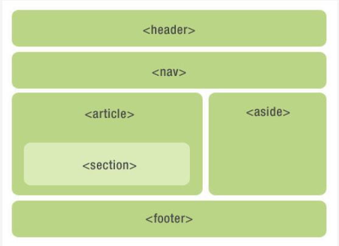
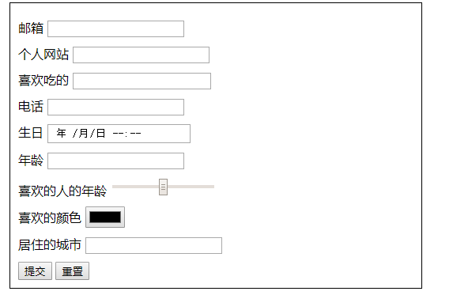
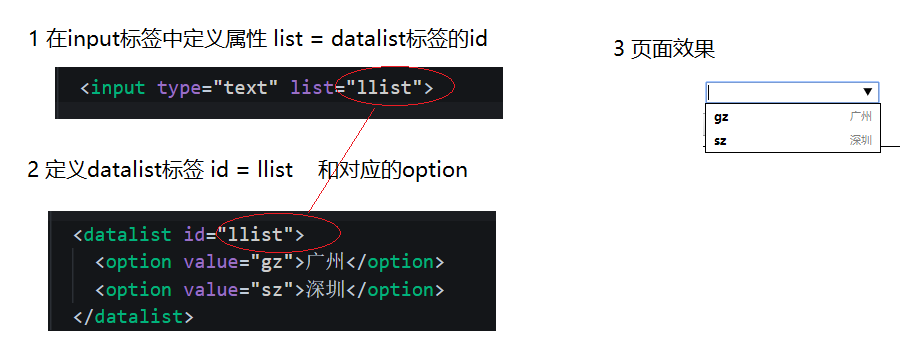
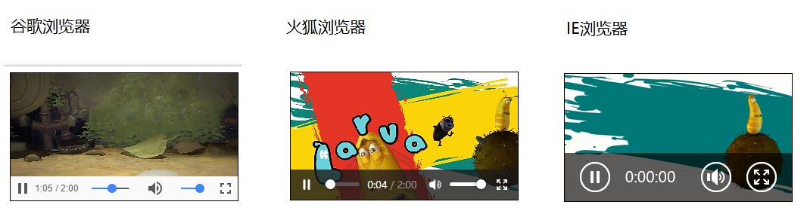
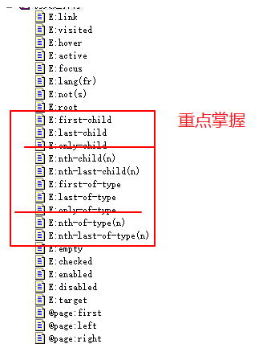
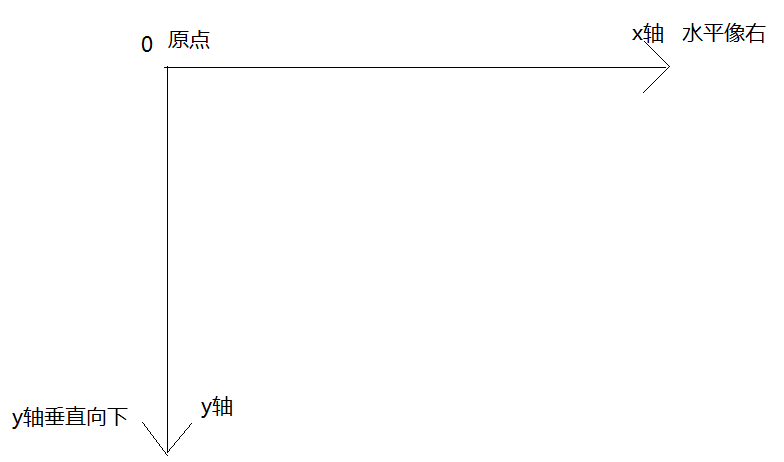

# day01 - 移动web开发_H5C3

## HTML5

> 学习目标：
>
> ​	了解 H5 新变化
>
> ​	掌握 H5 新增语义化标签
>
> ​	掌握 H5 新增多媒体标签
>
> ​	掌握 H5 新增 input 表单、表单属性

## 1.1. 语义化标签 了解

使用语义化标签的好处是增强了代码的可阅读性，也方便了网站的seo（Search Engine Optimization，搜索引擎优化）。

- header  头部标签
- nav 导航标签
- article 内容标签
- section 块级标签
- aside 侧边栏标签
- footer 尾部标签




## 1.2. h5表单

h5表单分为三大部分来学习 **输入标签**、**表单属性** 和 **表单事件**

### 1.2.1 h5表单标签

对于h5表单标签的学习，以下案例已经包含了所有的新知识，我们只需要做个选择题即可，看着案例来学习新标签即可。



#### 1.2.1.1. 常见输入类型

```html
text 
password 
radio 
checkbox 

file 
hidden 

submit 
button 
reset 
image
```

#### 1.2.1.2. 新的输入类型

- email 邮箱  

- url 网址 

- search 搜索 

- tel 电话 

- 日期等 

  - date
  - time
  - datetime
  - datetime-local
  - month
  - week

- number 数字输入框

  - min 最小值
  - max 最大值
  - step 步长

- range 范围

  - min 最小值
  - max 最大值
  - step 步长

- color 颜色

  - 标签的value属性中写颜色值只能写 这格式 `#000000`

- datalist 可输入表单

  

### 1.2.2. h5表单属性

- placeholder:占位符-提示信息

- autofocus:自动获得焦点-一般页面中放1个

- autocomplete 自动完成

  - 当用户在字段开始键入时，浏览器基于之前键入过的值，应该显示出在字段中填写的选项。
  - 默认已经打开 如 `autocomplete=on`  关闭 `autocomplete =off`
  - 需要放在表单内同时加上name属性

- multiple:可以多选文件提交

  - 结合文件上传标签   `<input type="file" >`   一起使用

- form属性，可以将输入标签放在表单的外面，还受到表单的管理 

  ```html
  <!-- 指定了id为ff -->
  <form action="" id="ff" >
    <input type="submit" value="提交">
  </form>
  <!-- 指定了属性form，值为表单的id=ff -->
  <input type="text" required form="ff"  >
  ```


- required:必填验证
- novalidate:关闭验证
  - 在表单上添加该属性，那么在提交的时候就不会再执行 required验证
- pattern：自定义验证-通过编写正则表达式自定义验证规则 一般和required同时使用
  - 表单事件

## 1.2. 多媒体标签

多媒体标签分为 音频 **audio** 和视频 **video** 两个标签 使用它们，我们可以很方便的在页面中嵌入音频和视频，而不再去使用落后的flash和其他浏览器插件了。

因为多媒体标签的 属性、方法、事件比较多，因此我们需要什么功能的时候，就需要去查找相关的文档进行学习使用。


### 1.2.1. audio 音频标签

**使用**

```html
<audio src="小猪佩奇.mp3" autoplay> </audio>
```

**支持的格式**

| 格式   | MIME-type  |
| ---- | ---------- |
| MP3  | audio/mpeg |
| Ogg  | audio/ogg  |
| Wav  | audio/wav  |

### 1.2.2. video 视频标签

**使用**

```html
  <video src="小猪佩奇.mp4" autoplay controls ></video>
```

**支持的格式**

| 格式   | MIME-type  |
| ---- | ---------- |
| MP4  | video/mp4  |
| WebM | video/webm |
| Ogg  | video/ogg  |

**video常用属性、方法、事件**

| 属性                 | 方法       | 事件                  |
| ------------------ | -------- | ------------------- |
| duration  视频播放时长   | play 播放  | canplay 视频加载完毕 准备播放 |
| currentTime 当前播放进度 | pause 暂停 | timeupdate 播放时-持续触发 |
| volume 音量大小        |          |                     |

**source标签**

可以通过在多媒体标签内加入**source**标签，用来指定多个播放路径，当第一个**source**标签的路径出错时，自动会切换到第二个**source**标签

```html
    <!-- 当1.mp4出错时，自动切换到2.mp4 ... -->
    <video >
      <source src="1.mp4">
      <source src="2.mp4">
      <source src="3.mp4">
    </video>
```

**object-fit属性**

当**video**标签视频内容宽度没有铺满video标签时，可以在css写上 该属性即可

```css
    video {
      /* 让视频内容铺满整个video标签 */
      object-fit: fill;
    }
```

### 1.2.3. 兼容性

因为多媒体标签在不同的浏览器下是不一样的外观，我们有时候需要统一所有的样式，所以就需要我们自己使用**div + 多媒体 **的一些api实现 控制条工具 。



### 1.2.4. 公共属性

以下属性 是要直接写在标签上的 如 **autoplay** **controls**

```html
<video src="小猪佩奇.mp4" autoplay controls ></video>
```

| 属性       | 值        | 描述                                       |
| -------- | -------- | ---------------------------------------- |
| autoplay | autoplay | 如果出现该属性，则音频在就绪后马上播放。                     |
| controls | controls | 如果出现该属性，则向用户显示控件，比如播放按钮。                 |
| loop     | loop     | 如果出现该属性，则每当音频结束时重新开始播放。                  |
| muted    | muted    | 规定视频输出应该被静音。                             |
| preload  | preload  | 如果出现该属性，则音频在页面加载时进行加载，并预备播放。如果使用 "autoplay"，则忽略该属性。 |
| src      | *url*    | 要播放的音频的 URL。                             |

## 1.3. 伪类选择符

伪类选择符其实我们在基础班就已经学习过一些了，看看它们的大家族



因为有些常用 有些不常用。所以我们就只学习常用的即可

### 1.3.1. E:first-child

匹配父元素的第一个子元素E。

```html
  <style>
    ul li:first-child{
      background-color: red;
    }
  </style>

  <ul>
    <li>列表项一</li>
    <li>列表项二</li>
    <li>列表项三</li>
    <li>列表项四</li>
  </ul>
```


**E:last-child**  则是选择到了最后一个li标签 


### 1.3.2. E:nth-child(n)    E:nth-last-child(n)

匹配到父元素的第n个元素 或者 是倒数第n个元素

相比 `E:first-child`   则要强大了不少，功能如下 （**死记硬背是最好的**）

- 匹配到父元素的第2个子元素  

  `ul li:nth-child(2){}`

- 匹配到父元素的倒数第2个子元素

  `ul li:nth-last-child(2){}`

- 匹配到父元素的序号为奇数的子元素

  `ul li:nth-child(odd){}`    **odd** 是关键字  奇数的意思（3个字母 ）

- 匹配到父元素的序号为偶数的子元素 

  `ul li:nth-child(even){}`   **even**（4个字母 ）

- **匹配到父元素的前3个子元素**

  `ul li:nth-child(-n+3){}`    

  选择器中的  **n** 是怎么变化的呢？

  因为 n是从 0 ，1，2，3.. 一直递增

  所以 -n+3 就变成了   

  - n=0 时   -0+3=3
  - n=1时    -1+3=2
  - n=2时    -2+3=1
  - n=3时    -3+3=0 
  - ...

- 匹配到父元素的后3个子元素

  `ul li:nth-last-child(-n+3){}`

### 1.3.3. E:nth-of-type(n)

这里只讲明  **E:nth-child(n)**  和 **E:nth-of-type(n)**  的区别  剩下的 **E:first-of-type**     **E:last-of-type**  **E:nth-last-of-type(n)**   同理做推导即可

```html
  <style>
    ul li:nth-child(2){
      /* 字体变成红色 */
        color: red;
    }

    ul li:nth-of-type(2){
      /* 背景变成绿色 */
      background-color: green;
    }
  </style>


  <ul>
    <li>列表项一</li>
    <p>乱来的p标签</p>
    <li>列表项二</li>
    <li>列表项三</li>
    <li>列表项四</li>
  </ul>
```


也就是说

- `E:nth-child(n)`     匹配父元素的第n个子元素E。
- `E:nth-of-type(n)` 匹配同类型中的第n个同级兄弟元素E。


## 1.4. 属性选择符 了解

1. E[att] 选择具有att属性的E元素。
2. E[att="val"] 选择具有att属性且属性值等于val的E元素。
3. E[att^="val"] 选择具有att属性且属性值为以val开头的字符串的E元素。
4. E[att$="val"] 选择具有att属性且属性值为包含val的字符串的E元素
5. E[att*="val"] 选择具有att属性且属性值为包含val的字符串的E元素。


## 1.5. 伪元素选择器 了解

### 1.5.1. 伪元素种类

1. E::before   在E元素前插入一个元素
2. E::after  在E元素后插入一个元素
3. E::first-letter 选择到了E容器内的第一个字母  
4. E::first-line 选择到了E容器内的第一行文本

### 1.5.2. h5写法和传统写法区别 了解

1. 单冒号 `E:before`
2. 双冒号 `E::before`
3. 浏览器对以上写法都能识别 **双冒号** 是h5上语法的规范

### 1.5.3. 伪元素的注意事项 了解

想要让伪元素有效，必须遵循以下注意事项

1. 伪元素只能给双标签加 不能给单标签加
2. 伪元素的冒号前不能有空格 如 `E    ::before`  这个写法是错误的
3. 伪元素里面必须写上属性 `content:""`;


## 1.6. 2D转换（变换）transform

2d转换是改变标签在**2维平面**上的**位置和形状**的一种技术，先来学习2维坐标系

### 1.6.1. 2维坐标系

**2维坐标系**其实就是指布局的时候的坐标系 如图



### 1.6.2. 2d移动 translate

2d移动是2d转换里面的一种功能，可以改变元素在页面中的位置，类似 **定位**

使用2d移动的步骤：

1. 给元素添加 **转换属性**  `transform`
2. 属性值为 `translate(x,y)`  如  `transform:translate(50px,50px)`;

```css
  div{
    transform: translate(50px,50px);
  }
```


#### 1.6.2.1. 小结

1. **translate**中的百分比单位是相对于自身元素的  `translate:(50%,50%);`
2. **translate**类似定位，不会影响到其他元素的位置
3. 对行内标签没有效果

