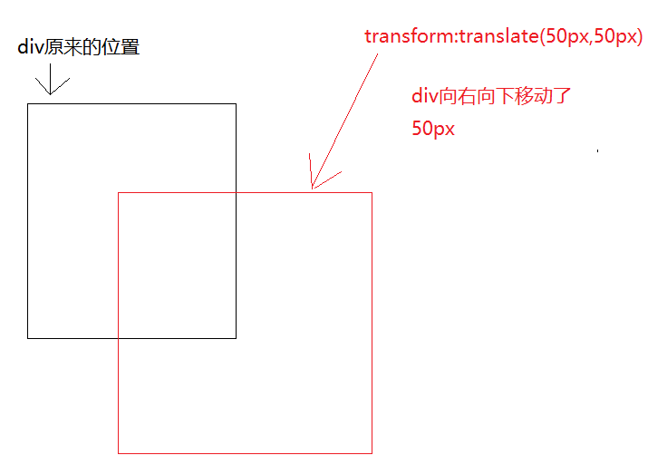
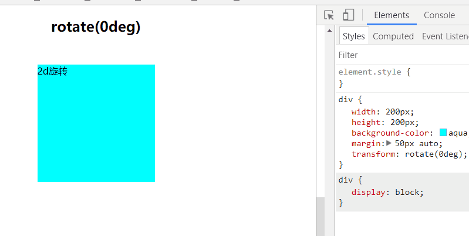
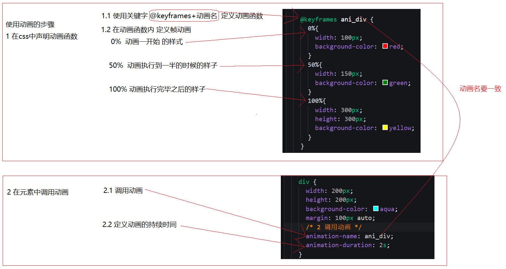

# day02 - 移动web开发_H5C3

## 1.1. 2D转换（变换）transform

2d转换是改变标签在**2维平面**上的**位置和形状**的一种技术，先来学习2维坐标系

### 1.1.1. 2维坐标系

**2维坐标系**其实就是指布局的时候的坐标系 如图


### 1.1.2. 2d移动 translate

2d移动是2d转换里面的一种功能，可以改变元素在页面中的位置，类似 **定位**

使用2d移动的步骤：

1. 给元素添加 **转换属性**  `transform`
2. 属性值为 `translate(x,y)`  如  `transform:translate(50px,50px)`;

```css
  div{
    transform: translate(50px,50px);
  }
```



#### 1.1.2.1. 小结

1. **translate**中的百分比单位是相对于自身元素的  `translate:(50%,50%);`
2. **translate**类似定位，不会影响到其他元素的位置
3. 对行内标签没有效果

### 1.1.3. 2d旋转 rotate

2d旋转指的是让元素在2维平面内顺时针旋转或者逆时针旋转

使用步骤：

1. 给元素添加转换属性 `transform`
2. 属性值为 `rotate(角度)`  如 `transform:rotate(30deg)`  顺时针方向旋转**30度**

```css
div{
      transform: rotate(0deg);
}
```

在浏览器中手动修改 **rotate**



观察过后，2d旋转有以下特点

1. 角度为正时 顺时针 负时 为逆时针
2. 默认旋转的中心点是元素的中心点

### 1.1.4. 转换中心 transform-origin 了解

该属性可以修改元素旋转的时候的中心点

1. transform-origin:**50% 50%;**  默认值  元素的中心位置 百分比是相对于自身的宽度和高度
2. transform-origin:**top left;**  左上角   和 transform-origin：0 0;相同
3. transform-origin:**50px 50px;**  距离左上角 50px 50px 的位置
4. transform-origin：**0**;  只写一个值的时候  第二个值默认为 50%;

### 1.1.5. 2d缩放 scale

缩放，顾名思义，可以放大和缩小。 只要给元素添加上了这个属性就能控制它放大还是缩小 

步骤：

1. 给元素添加转换属性 `transform`
2. 转换的属性值为 `scale(宽的倍数,高的倍数)`    如 宽变为两倍，高变为3倍 `transform:scale(2,3)`

```css
div{
    transform:scale(2,3);
}
```


#### 1.1.5.1. 小结

1. transform:scale(1,1) 放大一倍 相对于没有放大
2. transform:scale(2,2) 宽和高都放大了2倍
3. transform:scale(2)  只写一个参数 第二个参数则和第一个参数一样 相当于 scale(2,2)
4. transform:scale(0.5,0.5)  缩小 
5. transform:scale(-2,-2) 反向放大2倍    很少用负数 容易让人产生误解


## 2.1. 动画 animation

初学者容易对 **动画** 和 **过渡** 傻傻分不清楚

过渡 只能看到一次变化过程 如 **宽度  1000px  变化到  100px** 

**动画 可以设置变化的次数 甚至是无数次**   


### 2.1.1. 步骤

1. 在css中定义动画函数     
2. 给目标元素调用动画函数



```css
    /* 1 声明动画函数 */

    @keyframes ani_div {
      0%{
        width: 100px;
        background-color: red;
      }
      50%{
        width: 150px;
        background-color: green;
      }
      100%{
        width: 300px;
        height: 300px;
        background-color: yellow;
      }
    }

    div {
      width: 200px;
      height: 200px;
      background-color: aqua;
      margin: 100px auto;
      /* 2 调用动画 */
      animation-name: ani_div;
      /* 持续时间 */
      animation-duration: 2s;
    }
```

### 2.1.2. 语法1

1. 动画名

   设置要使用的动画名 `animation-name:xxx;`

2. 持续时间

   设置动画播放的持续时间  `animation-duration:3s`

3. 速度曲线

   和设置过渡的速度曲线一样 `animation-timing-function:linear;`

   - linear： 匀速
   - ease： 慢-快-慢  默认值
   - ease-in： 慢-快。
   - ease-out： 快-慢。
   - ease-in-out： 慢-快-慢。

4. 延迟时间

   `animation-delay: 0s;`

5. 循环次数

   设置动画播放的循环次数  `animation-iteration-count: 2;`  **infinite** 为无限循环

6. 循环方向

   `animation-direction`

   如在动画中定义了  **0%：红色**  **100%：黑色** 那么 当属性值为 

   1. **normal**  默认值  **红 -> 黑**
   2. **reverse** 反向运行    **黑 -> 红**
   3. **alternate**  正-反-正...  **红 -> 黑 -> 红...**  
   4. **alternate-reverse**  反-正-反..   **黑 -> 红 -> 黑 ...** 
   5. 以上与循环次数有关

7. 动画等待或者结束的状态

   `animation-fill-mode` 设置动画在等待或者结束的时候的状态

   - **forwards**：动画结束后，元素样式停留在 100% 的样式
   - **backwards**： 在延迟等待的时间内，元素样式停留在 0% 的样式
   - **both**： 同时设置了 forwards和backwards两个属性值

8. 暂停和播放

   `animation-play-state`  控制 **播放** 还是 **暂停** 

   `running` 播放   `paused` 暂停

### 2.1.3. 复合写法

```css
animation: name duration timing-function delay iteration-count direction fill-mode;
```

### 2.1.4. 多个动画写法

用逗号分隔

```css
animation:
name duration timing-function delay iteration-count direction fill-mode，
animation: name duration timing-function delay iteration-count direction fill-mode;
```

### 2.1.5. 动画结束事件animationend

元素在动画结束之后，会自动触发的事件 **animationend**   

```javascript
    var div = document.querySelector("div");
    div.addEventListener("animationend", function () {
      console.log("div的动画结束之后，触发");
    })
```


## 2.2.1 动画库animate.css

封装了常见的有意思的小动画  **发疯似的建议看官网来学习使用**

[官网](https://daneden.github.io/animate.css/)

[中文](https://www.awesomes.cn/repo/daneden/animate-css)

### 2.3.1. 使用步骤

1. 引入css文件

   ```html
   <head>
     <link rel="stylesheet" href="animate.min.css">
   </head>
   ```

2. 给元素添加对应的class

   ```html
   <h1 class="animated infinite bounce">快来看看我</h1>
   ```

   简单解读：

   `animated`  必须添加的class 

   `infinite` 无限播放 

   `bounce` 弹跳动画的效果，可以查官网自己选择喜欢的

### 2.3.2. css3兼容处理

css3涉及到较多的新属性，某些低版本（如ie8以及以下）的浏览器对css3的支持程度不够，因此需要做以下处理

添加对应的浏览器的前缀 常见前缀如下

- 谷歌 -webkit
- 火狐 -moz
- IE -ms

如对 `border-radius` 进行兼容性处理   

```css
      -webkit-border-radius: 30px 10px;
      -moz-border-radius: 30px 10px;
      -ms-border-radius: 30px 10px;
	  // border-radius 一定要放在最后
      border-radius: 30px 10px;
```

如果发现添加前缀也解决不了兼容性问题，那么就不要使用该css3属性