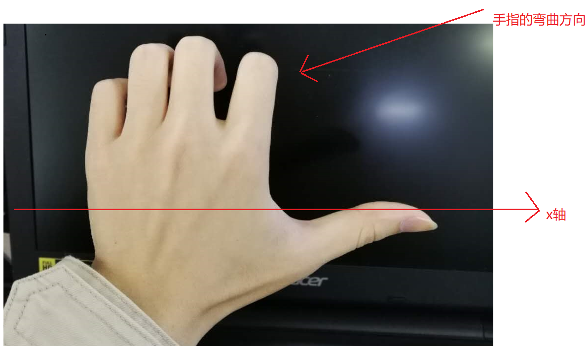

# day02 - 移动web开发_H5C3

## 1.1. 学习目标

- 理解
  - 3d转换的中的3d移动，3d旋转
  - 动画属性的设置和使用
  - animate.css动画库的使用


## 1.1. 3D转换（变换）

3d转换是改变标签在3**坐标系**上的**位置和形状**的一种技术   以下知识点最好结合 [3d模型工具来理解](3d演示工具.html)

### 1.1.1. 3维坐标系

3维坐标系其实就是指立体空间，立体空间是由3个轴共同组成的  

- x轴 水平向右 
- y轴 垂直向下 
- z轴 垂直屏幕 由屏幕里面指向屏幕的外面  


### 1.1.2. 3d移动 translate3d

3d移动在2d移动的基础上多加了一个可以移动的方向，就是z轴方向


**语法：**

1. transform:**translate3d**(x,y,z)  其中 **x y z** 分别指要移动的轴的方向的距离
2. translform:**translateX**(100px)  仅仅是移动在x轴上移动
3. translform:**translateY**(100px)  仅仅是移动在Y轴上移动
4. translform:**translateZ**(100px)  仅仅是移动在Z轴上移动  

**注意**:

因为z轴是垂直屏幕，由里指向外面，所以 默认是看不到元素在z轴的方向上移动，想要看到，可以使用下面的 **视距** 属性设置


### 1.1.3. 视距 perspertive 了解

人在看物体时，有个规律，如 **远的物体看起来小** **近的物体看起来大**   

**perspertive** 就是用来设置  **人** 和 **物体** 的距离      


如 我们想要看到 物体 在z轴上的移动  的 **远大近小** 效果时  

1. 设置物体的 `translateZ` 一般大于 0  如  `transform:translateZ(100px)`
2. 设置 人和物体的距离 - 视距    这个值规定要设置给**物体的父元素**   `perspertive:1000px`
3. 动态改变物体的 `translateZ` 即可观察效果

```css
    /* 父元素 */
    body {
      /* 视距 */
      perspective: 1000px;
    }

    /* 目标 */
    div {
      width: 200px;
      height: 200px;
      background-color: aqua;
      margin: 100px auto;
      /* z轴的移动 */
      transform: translateZ(0px);
    }
```


#### 1.1.3.1. 小结

1. translateZ的值和perspertive都要大于0 否则容易出现兼容性问题


### 1.1.4. 3d旋转 rotate3d

3d旋转指可以让元素在3维平面内沿着 **x轴，y轴，z轴或者自定义轴**进行旋转  对于元素旋转的方向的判断 我们需要先学习一个**左手准则**

#### 1.1.4.1. 左手准则

比如要判断某元素沿着x轴是怎么旋转的

1. 左手的手拇指指向 x轴的正方向
2. 其余手指的弯曲方向就是该元素沿着x轴旋转的方向了




#### 1.1.4.2. 例子1

我现在想让元素沿着 x轴正方向旋转90度

```css
    /* 沿着x轴正方向旋转90度 deg为单位 */
      transform: rotateX(90deg);
```

  


可以通过自己的代码测试 让物体沿着y轴 z轴旋转，加深了解。

#### 1.1.4.3. 语法

1. `transform:rotateX(45deg);` 沿着x轴正方向旋转 45度
2. `transform:rotateY(45deg)` 沿着y轴正方向旋转 45deg
3. `transform:rotateZ(45deg)` 沿着Z轴正方向旋转 45deg
4. `transform:rotate3d(x,y,z,deg)` 沿着自定义轴旋转 deg为角度  了解即可

### 1.1.5. 3D缩放 scale3d 了解

3d缩放 可以控制元素 在 x轴，y轴，z轴上的缩放，也可以理解为 宽，高，厚度的缩放。 结合[3d模型工具学习](3d演示工具.html)

#### 1.1.5.1. 语法

1. `transform: scale3d(1 ,1,2);`  宽，高 缩放一倍，厚度放大两倍
2. `transform: scaleX(1)` 只缩放宽
3. `transform: scaleY(1)` 只缩放高
4. `transform: scaleZ(1)` 只缩放厚  

### 1.1.6. 视距原点 perspective-origin 了解

回顾**视距**知识点，

视距可以设置 **人 和 物体** 之间的距离 也就是z轴方向的距离   

而  **视距原点** 可以设置 人 站在x轴和y轴的位置。


1. 视距原点和视距一样，也是设置给要观察元素的**父元素**上
2. perspective-origin:center center; 默认值是**元素的中心点**
3. perspective-origin:10px；  指定了一个参数的时候，第二个参数默认为center 也就是50%；
4. perspective-origin:10% %； 百分比都是相对于自身的宽度和高度

### 1.1.7. 转换样式  transform-style 了解

结合3d立方体案例理解，控制**子元素**是否开启3维立体环境

- `transform-style: flat;`  平面模式  -  不开启3维立体环境
- `transform-style: preserve-3d;`  3维立体环境

### 1.1.8. 3D转换总结

1. 百分比单位都是相对于自身
2. 视距、视距原点、转换样式 这三个属性都是给**父元素**添加的


## 1.2. css3兼容处理

css3涉及到较多的新属性，某些低版本（如ie8以及以下）的浏览器对css3的支持程度不够，因此需要做以下处理

添加对应的浏览器的前缀 常见前缀如下

- 谷歌 -webkit
- 火狐 -moz
- IE -ms

如对 `border-radius` 进行兼容性处理   

```css
      -webkit-border-radius: 30px 10px;
      -moz-border-radius: 30px 10px;
      -ms-border-radius: 30px 10px;
	  // border-radius 一定要放在最后
      border-radius: 30px 10px;
```

如果发现添加前缀也解决不了兼容性问题，那么就不要使用该css3属性